# Week 1 Android Studio

This is the 1st of a series of 11-week exercises for Module 387COM at Coventry University. These exercises are designed to expose different aspects of Android programming to 3rd year Computer Science/Multimedia Computing students here at Coventry.

Before you start, you should have some experience with programming and a good knowledge of basic principles of OOP. Understanding of Java syntax is desired but not essential as we have some dedicated sessions for the language itself.

The expected outcomes after the module are:

1. Demonstrate familiarity with the Java Programming language and the Android Studio.
2. Design applications suitable for Android devices.
3. Use the Android software development kit and an emulator to develop applications for the Android platform.
4. Make use of the main modes of interaction available on a smartphone platform.

## Lab 1 Introduction to Android Studio

In this 1st lab, you'll find out the things you need to have to become an Android developer. You'll also design and run your 1st Android app.

### What is Android?

First of all, let's ask a question - what is Android? Well, the answer depends on who you ask. There're several different levels to define Android: on the very deep level, it's a Linux operating system that controls a bunch of hardware and sensors. This is the same as any other operating systems such as Mac/Windows; on the very superficial level, Android are devices such as Samsung Galaxy or HTC; For us, Android developers, Android is an application runtime that we can develop codes which will turn into Dalvik virtual machines a.k.a. mobile apps.


Android has been around for a while, hence we have different versions. For each version of Android, we have a 'sweet' codename with the latest being 'Marshmallow', which is still in beta and not shown in the picture below.


Different versions of Android offer slightly different features, and also they have different market share. At the time of writing, KitKat (4.4) and Jelly Bean (4.1/4.2/4.3) are dominating. As you can imagine as new devices are coming to the market and old ones are gradually phasing out, this market share evolves over time. As a developer, you have to consider your targeting devices/platforms. We'll come to that later on.


> Click [here](https://source.android.com/source/build-numbers.html) for a list of Android version numbers and corresponding code names, [here](https://developer.android.com/about/dashboards/index.html) for an up-to-date distribution list. 

In this module we concentrate on the developing *native* apps using Java, Android SDK, and Android Studio exclusively. Native apps offer many advantages such as platform integration and speed. But you should be aware that there're quite a number of other tools that you can use to develop apps for Android devices. These include [PhoneGap](http://phonegap.com/) and [Xamarin](https://xamarin.com/) for example.

### Installation

You'll need the following to be an Android developer:

> If you're looking at this in ECM15, you can quickly glance through this section now as everything you need has been done for you. We have also requested that the same thing to be installed on every single machine in the EC building. But if you're looking at this on your own laptop, you need to read on carefully.

> I use Mac (most probably) to illustrate as you'll be using Macs in ECM15. But if you use Windows it shouldn't be too difficult to figure out the differences. If you get stuck, just ask!

1. Java JDK
2. Android Studio
3. Android SDK
4. A version of the Android system image
5. (optional) An Android device

A few words about Java: when you go to the [Java download page](http://www.oracle.com/technetwork/java/javase/downloads/index.html) click on the JDK, which will lead you to a diffent page to choose your platform. There you'll see two options, select the one without demos and samples as the size is smaller. Wondering the difference between JDK and JRE? Read [this](http://stackoverflow.com/questions/1906445/what-is-the-difference-between-jdk-and-jre).

Next, you'll need to [download](http://developer.android.com/sdk/index.html) and install Android Studio. Once you click the download button from the previous link, you'll be automatically redirected to the [Install Android Studio](http://developer.android.com/sdk/index.html) help page. You can get some help from there if something goes wrong. Otherwise just choose all default settings. Note once it's installed, next time you open it it will probably ask for permissions to update. My advice is that don't update unless its really necessary, at least for the duration of the module. The reason being that configuring a working IDE for Android might take a considerable amount of time!

Once installed, click on the 'Configure' menu under 'Quick Start' tab, and then click 'SDK Manager', which will bring up the 'Android SDK' preference settings. Now check version 6.0 and version 5.1.1 and click apply to download the SDK. Once again, next time you open it it will probably ask for permissions to update - DON'T!

> This way of installing SDK is easy when you first get started. But the drawback is it takes a lot disk space. When you get your head around different SDK components, you might want to customize the installation using SDK Manager.


If you click the 'Launch Standalone SDK Manager', you'll see the standalone SDK manager window (you guessed it!). Make sure that Intel Accelerator is installed. When you click the check box to install, what actually being installed is just the installation package. You'll need to find out where the installation package is and double click it. Read [this](https://software.intel.com/en-us/android/articles/installation-instructions-for-intel-hardware-accelerated-execution-manager-windows) to get more help.

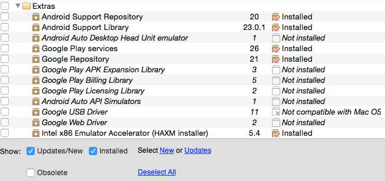

When you finally write your own app you want to test and see how it works, that's why we need an Android system image and the optional Android device. From my own experience real devices run much faster than AVDs (Android virtual devices). Well, I guess it's not just myself, other people are complaining too, see [here](http://stackoverflow.com/questions/1554099/why-is-the-android-emulator-so-slow-how-can-we-speed-up-the-android-emulator). So I would encourage you to use your own device. If you don't have one, don't worry, an ADV has been installed together with Android Studio. We'll come back to that later on.

> I had previously been shown with someone's Mac where Android Studio cannot figure out the installation path of Java. If that happens to you, did you install all these stuff in the right order? If you didn't, a 'brute force' fix would be to remove everything and install in the correct order. But if you want to configure properly, Java is normally installed under /Library/Java/JavaVirtualMachines/.

### Hello Android!

Follow the steps below to create and run your first Android app:

1. In Android Studio, click 'Start a new Android Studio project', and give it a name such as 'Hello Android'.
2. In 'Project location' settings select your desired location.
3. Next screen asks you to choose minimum SDK. The default value should do. If you want to know more about this minimum SDK, click on 'Help me choose' and read the info that comes up. Does it look familiar?

 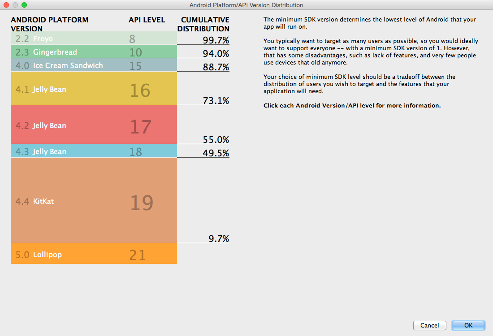

4. Use all default settings until you see Finish. Click Finish to create your first Android project. Your screen should look similar to below:

 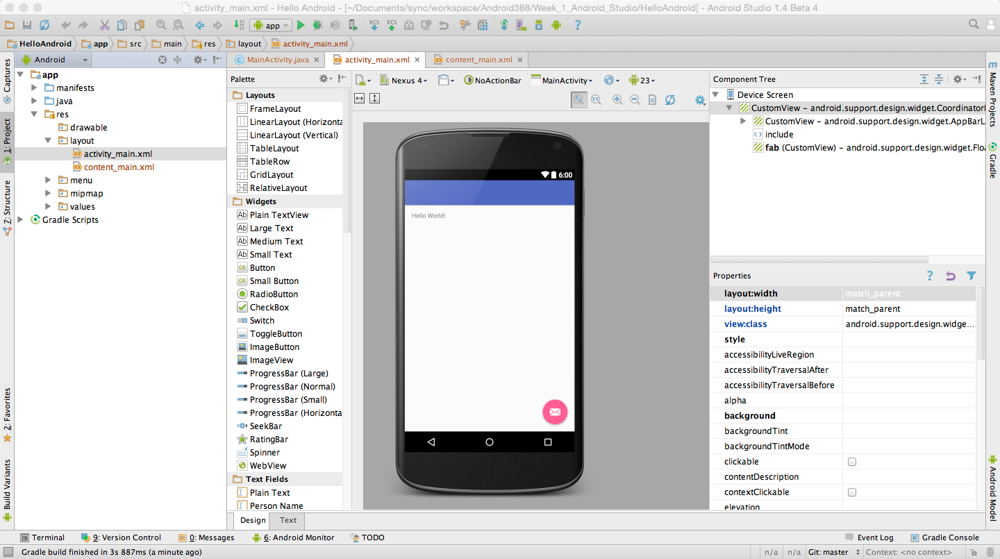
 
5. You're ready to run the app you just created. Before you do that, let's check if you have an emulator or Android device attached. Click Tools ==> Android ==> AVD Manager to show the AVD Manager. Make sure you have the default AVD installed. 

 If not, click 'Create Virtual Device' button to create a new one. The following settings for an AVD seem to work well on my machine: Phone, Nexus 5, targeting at latest Android 6.0 with Google APIs. And most importantly, 'Use Host GPU' is checked. Remember in the previous section where I showed you that you need to install the Intel accelerator, here is why. Click 'Finish' and you'll have a new AVD.
 
5. Click Run ==> Run 'app' to run the app you just created. In the window that pops up, click 'Launch emulator' and choose the desired AVD if you have more than one. BTW, you should only have 1 AVD running, otherwise the system will be rather slow. You will see HelloAndroid running in AVD similar to the one below.

 

6. If you are lucky enough to have an Android device attached to the computer you can use it for testing. But first of all you'll need to make your device debuggable. Use your device with Macs is a two-step process:

 1. You need to enable Developer options. On Android 4.2 and higher, the Developer options screen is hidden by default. To make it visible, go to Settings ==> About phone and tap Build number seven times. 
 2. Enable USB debugging on your device. On most devices running Android 3.2 or older, you can find the option under Settings ==> Applications ==> Development. On Android 4.0 and newer, it's in Settings ==> Developer options.
 
 If you want to use your device with a Windows machine, you'll have to install usb driver for your device. The driver can normally be downloaded from your phone maker's website. Check [here](http://developer.android.com/tools/device.html) if you get stuck.
 
 Now return to our Hello Android app. When I run it on my HTC it looks like the image below. Can you see any differences?
 
 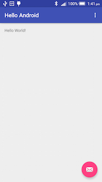

### Android Studio guided tour

Now it's time to go back to Android Studio and have a closer look at what we have done.

Android Studio is based on an Java IDE called IntelliJ IDEA. In fact, Google doesn't document Android Studio very well and sometimes you'll need to go to IntelliJ website to look for answers. The whole IDE window you saw earlier can be roughly divided into 5 areas:


> The image above is from [Jetbrains website](https://www.jetbrains.com/idea/help/guided-tour-around-intellij-idea-user-interface.html).

1. Menus and toolbars. This is pretty standard, but it gives you quick access to some common commands. For example, you can click the little green triangle to run your project. 
2. Navigation bar that tells you which file you're viewing and their relative position in the project.
3. The status bar shows various warning and information messages. Sometimes you see a message like 'gradle is running...' and this can take some time to disappear.
4. The editor. This is the main area you'll be working on.
5. Tool windows  - secondary windows that provide access to various specific tasks.

In the editor window, there're some important keyboard shortcuts that you need to be aware of. Double click 'activity_main.xml' to open it if it's not opened already. Click on the lower 'Text' tab to make sure you're viewing the text view. Press 'cmd' + 'a' to select everything, then press 'alt' + 'cmd' + 'l' to reformat it. Does it look nicer now?

> For a full list of useful shortcuts, check [here](http://developer.android.com/sdk/installing/studio-tips.html#KeyCommands)


Now take a look at the location you selected earlier to save the project. What you will see is that a bunch of files have been generated. Don't worry you don't need to know them all!


The most important ones, however, are being contained in app/src/main. Actually when I download samples from Android website, sometimes I just go into this folder and ignore the rest.

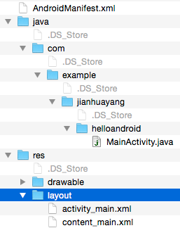

1. activity_main.xml. This is the XML layout file for the activity you added when you created the project with Android Studio. In simple words, in Android activity represent a single screen where your users can perform certain tasks. Thus this xml defines your first (and only) screen in your app. The file at the moment includes a TextView that displays the message "Hello world!" and a floating button.
2. MainActivity.java. This is the Java class that associates the xml layout file with different functions such as respond to button click. When you build and run the app, the Activity class starts the activity and loads the layout file that says "Hello World!".
3. AndroidManifest.xml. The manifest file describes the fundamental characteristics of the app and defines each of its components. For example, it defines if your app needs to access the GPS sensor.

> On the official [Android developer website](https://developer.android.com/tools/projects/index.html), you'll see full descriptions of different files.

We were talking about Android Studio, but why all of a sudden we turned to our hard drive? Here is why - when you look at the 'Project' tool window to the left, you'll see some files being displayed. And those are the files we've just talked about! In this 'Project' mode, you'll see important files but not in their ordinary tree structure. There're several different modes in this tool window apart from the 'Android' mode. For example, if you choose 'Project' mode the window will display file trees that assemble what's available on your hard drive.


### Android vs iOS

When talking about Android, you need to know what else there are in the market. It's very likely that in the future you'll be asked to develop an Android app as well as an iOS app. But biggest advantage Android offers is that it's free. That's probably why the market share is dominantly higher than its competitors.


Technically speaking, the two big players in the mobile OS market i.e. Android and iOS share a lot of things in common and at the same time have lots of differences. As a developer you need to bare this in mind. One simple example is that Android has a physical or virtual back button, so there's no need to show a 'back' click on the screen. But for iOS we definitely need one.


## Lab 2 Debugging

In this 2nd lab, you'll go one step further from the previous lab by adding some UI elements to your activity. Also, you'll learn the basics of logging and debugging. In addition, I'll show you how to use Android Studio's built-in version control menu.

### Hello Me!

Follow steps below to create another app:

1. In Android Studio, click 'Start a new Android Studio project', and give it a name such as 'Hello Me'.
2. In 'Project location' settings select your desired location. 
3. Use all default settings until you see Finish. These steps are the same as before, and should become the *de facto* standard.
4. Double click to open 'content_main.xml' if it’s not opened already.

 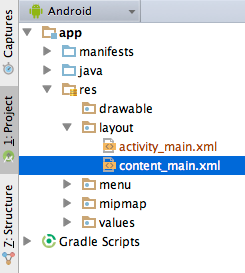

5. Under default settings the 'Text' view will show. Click 'Preview' tool window to the right edge of the IDE to bring up the Preview window. Your whole workbench should look like below.

 

6. Delete texts contained between '<span>&lt;</span>TextView' and the closing '/>'. You'll see that the words 'Hello World' disappeared on the preview window.

 > See the little camera in the Preview window menu bar. Guess what it does?

7. Click the 'Design' tab to switch to the design view. Locate and drag the following four widgets from Palette to the layout one by one: Plain TextView, SmallText, PersonName, Button. Your Component Tree should look at the following

 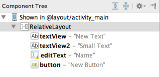

8. At this point, if you click one of the widgets you just dragged onto the graphical layout, you can change its properties using the Properties window. Try to change some of the properties to see the effects, and we’ll change them back later.

 > The graphical layout in the design view is not to be confused with preview in the text view. The preview tool is more powerful for example sometimes it gives error message 'Rendering Problems.
 
9. Click the 'Text' tab to go back to the text view. Manually edit the xml file, make it look like the following

 ```xml
     <TextView
        android:id="@+id/textViewDisplay"
        android:layout_width="wrap_content"
        android:layout_height="wrap_content"
        android:text="Hello World"
        android:textSize="24sp" />

    <TextView
        android:id="@+id/textView1"
        android:layout_width="wrap_content"
        android:layout_height="wrap_content"
        android:layout_alignLeft="@id/textViewDisplay"
        android:layout_below="@id/textViewDisplay"
        android:layout_marginLeft="19dp"
        android:layout_marginTop="56dp"
        android:text="Name:"
        android:textAppearance="?android:attr/textAppearanceSmall" />

    <EditText
        android:id="@+id/editText"
        android:layout_width="wrap_content"
        android:layout_height="wrap_content"
        android:layout_alignBaseline="@id/textView1"
        android:layout_alignBottom="@id/textView1"
        android:layout_marginLeft="36dp"
        android:layout_toRightOf="@id/textView1"
        android:ems="10"
        android:inputType="textPersonName" />

    <Button
        android:id="@+id/button"
        android:layout_width="wrap_content"
        android:layout_height="wrap_content"
        android:layout_below="@+id/editText"
        android:layout_centerHorizontal="true"
        android:layout_marginTop="22dp"
        android:text="Display" />
 ```
 > Don't worry if you don't fully understand all these, we'll go through them later on.

10. Open MainActivity.java, create a method called onButtonClick that looks like below:

 ```java
     public void onButtonClick(View view) {
        EditText editName = (EditText) findViewById(R.id.editText);
        TextView textDisplay = (TextView) findViewById(R.id.textViewDisplay);
        String nameToDisplay = editName.getText().toString();
        textDisplay.setText("Hello " + nameToDisplay);
    }
 ```
 Note when you first use a class that hasn't been imported, Android Studio will show the class name in red. You'll need to import the class. The keyboard shortcut to do the importing is 'alt' + 'enter'.

11. Go back to the layout xml file you modified before, change the Button tag to include the following attribute:

 ```xml
 android:onClick="onButtonClick"
 ```
 > In order to create a method that responds to user clicks, the method needs to have a signature of 'public void doSomething(View view)'.

12. Now if you run this app, once you input something for example your name and click Display, your name will appear in the greeting message. 


### Logging and debugging

**Logging**

Sometimes when you program your app you want to see your programme's outputs but you want to hide it from your users. Android logging system is what you need. Do the following to produce a log in the previous app you created.

1. Add a line of code in the 'onButtonClick' method, so it looks like below

 ```java
 public void onButtonClick(View view) {
        EditText editName = (EditText) findViewById(R.id.editText);
        TextView textDisplay = (TextView) findViewById(R.id.textViewDisplay);
        String nameToDisplay = editName.getText().toString();
        textDisplay.setText("Hello " + nameToDisplay);
        Log.d(TAG, nameToDisplay + ", this is your system log!");
    }
 ````
 
2. Note 'Log.d' appears in red color. Move your mouse into it and press 'alt' + 'enter' to import Log class.
3. Also note that 'TAG' appears in red color too. This is because the variable hasn't been declared. Now go to the line which is just after Activity class signature (and before onCreate method), and insert the following:

 ```java
     private static final String TAG = "HelloMeActivity";
 ```

4. Run the app and input your name in the textbox and then click 'DISPLAY'. In 'Android Monitor' tool window under the logcat tab, key in 'HelloMeActivity', you should see the message similar to below. If you click 'DISPLAY' another time, you'll see the message comes up twice.


**Simple debugging**

Logging allows you to see the output your app produces, but sometimes you want to interact with your app while it's running to check variable values etc. Now you'll need to use the debug tool. 

1. Click on the left margin of the editor (there's a name for this area, which is 'Gutter') to set break points. First one at line 61, and second one at line 62.

 

2. Click Run ==> Debug 'app' to run in the debug mode. Key in your name in the text box and hit 'Display'. Now you'll see that your app stops at the first break point.

 

3. Click on the right most icon on the horizontal mini toolbar to bring up the 'Evaluate expression' window and type in 'nameToDisplay'. This gives you no results as expected, as the app hasn't reached that line yet.

4. Click on the top icon on the vertical mini toolbar to resume the programme. Now you'll see that variable you looked for previously i.e. 'nameToDisplay' is already there being displayed.

### Git version control

Android studio has built-in version control system (VCS) support. In fact, there's a system drop-down menu dedicated for it. Android Studio supports several different VCS tools. We'll use Git in all our examples as it's the most popular tool.

1. Check if Git is available on the system. On machines in ECM15 Git has been installed. Open a terminal window and type in 'git' and then enter, if you see something like 'agreeing to the xcode/ios license requires admin privileges, please re-run as root via sudo', that means Git hasn't been configured properly. If that happens to you, open Xcode and accept all licenses and then use the git command in terminal to check again. You should see the following.

 > If you use Windows, you'll need to [download](https://git-scm.com/downloads) and install Git.

 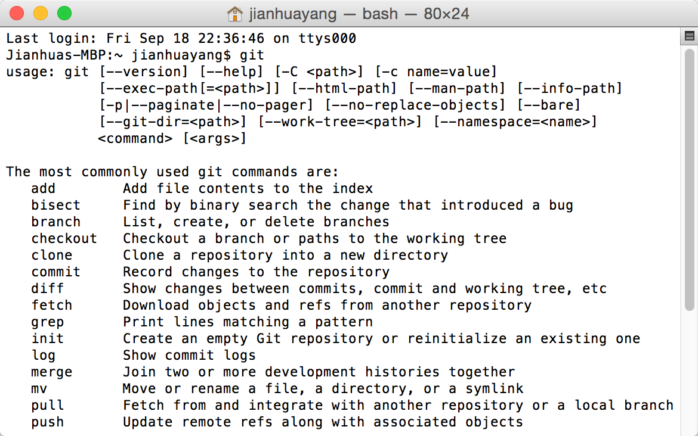

2. Go back to Android Studio, click VCS ==> Enable Version Control Integration..., and select Git as the tool. Now the 'Version Control' tool window will turn from pale to bright colors.

3. Locate your project title in the left-most position in the navigation bar, right click on it and select Git ==> Add to add all files in your current project under control o Git. If you look at the 'Local Changes' tab in the 'Version Control' tool window, your 'Unversioned Files' will disappear and all files are under 'Default'.

 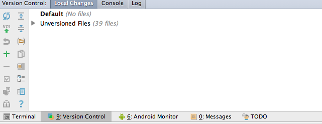
 
4. Click VCS ==> Commit Changes, and type in something as your commit message and hit commit. Your project at the current stage is saved in a snapshot, that means you can revert to it at any time later on.

 > Some people have problems with previous version of Android Studio here. If you cannot commit, uncheck all check boxes and try again.
 
 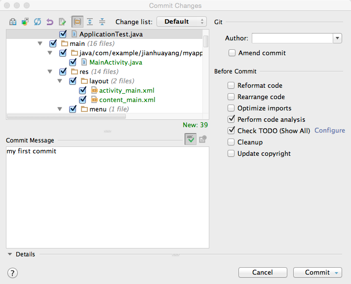

5. Now comes the important bit. In the assignment of the module you are required to create an app and submit using Bitbucket. To do this, you need to first of all create a new repository. Once created, go into that repository and copy the https URL by clicking  'three dots' ==> Clone ==> HTTPS. The URL that begins with https until the end is what you need. For example, my testing project is at https://jianhuayang@bitbucket.org/jianhuayang/test.git.

 > See [here](https://confluence.atlassian.com/bitbucket/create-a-repository-221449521.html) for official Atlassian documentation on create a repository.
 
 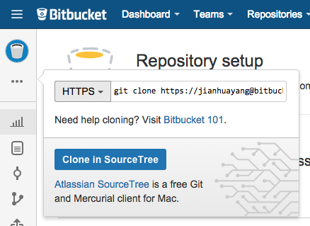

6. In Android Studio, select VCS ==> Git ==> Push, in the window that pops up click 'Define remote' and paste the URL that you noted previously. Now click Push and your project is online at Bitbucket. To verify that you've pushed successfully, you can see the console log, or you can check in the actual online repository.

## Lab 3 Advanced topics

For those of you who haven't complete previous labs, you can work on it if you wish. For those who have finished, in this final lab I'll ask some challenging questions for you to explore. These questions are related to previous labs, and somehow involves more efforts to complete.

### SDK components

In the 1st lab I showed you how to install SDK components using an easy approach. The advantage of doing it that way is it saves quite a lot efforts. But the other side of the coin is that it uses quite a lot of disk spaces. Now open the standalone SDK manager and see the things you have installed, try to answer the following questions:

 * Where are these tools physically located on your hard drive?
 * What are the different components, e.g. the difference between SDK tools, SDK platform-tools, SDK build-tools?

> Hint: [Android SDK Manager](http://developer.android.com/tools/help/sdk-manager.html)

### Command line tools

Following previous questions, once you locate different tools on your hard drive, the next steps is to use them. Instead of working on GUIs using your mouse, everything in Android development can be done using pure command line tools. Now the questions are:

* How to start AVD Manager from the command line?
* How to create a new project using command line tools?

> Hint: [Managing Projects from the Command Line](http://developer.android.com/tools/help/sdk-manager.html)


### More Git

The VCS tools I've showed you are supposed to be at introductory level. But Git itself is very sophisticated and extremely powerful. Now open a terminal window and navigate to the last project you created i.e. the one you set up to use Git in Android Studio. Issue the following commands and watch outputs, what do those mean?

* git init
* git log
* git status

> Hint: [Git References](http://gitref.org/creating/) and [File Status Highlights](https://www.jetbrains.com/idea/help/file-status-highlights.html) in Android Studio

### Android Design Principles

What every Android developer should know is that design comes before coding! There’re certain rules to follow when designing an app. With this regard, the official [Android Design Principles](http://developer.android.com/design/get-started/principles.html) and [Material design](http://www.google.com/design/spec/material-design/introduction.html) should be regarded as the 'bible'. However, keep in mind that most of these principles boil down to common sense, e.g. the rule that states you should keep your app simple and brief.

* What is balance and proximity in the context of mobile app design?
* What does 'material' refer to in Material Design?
