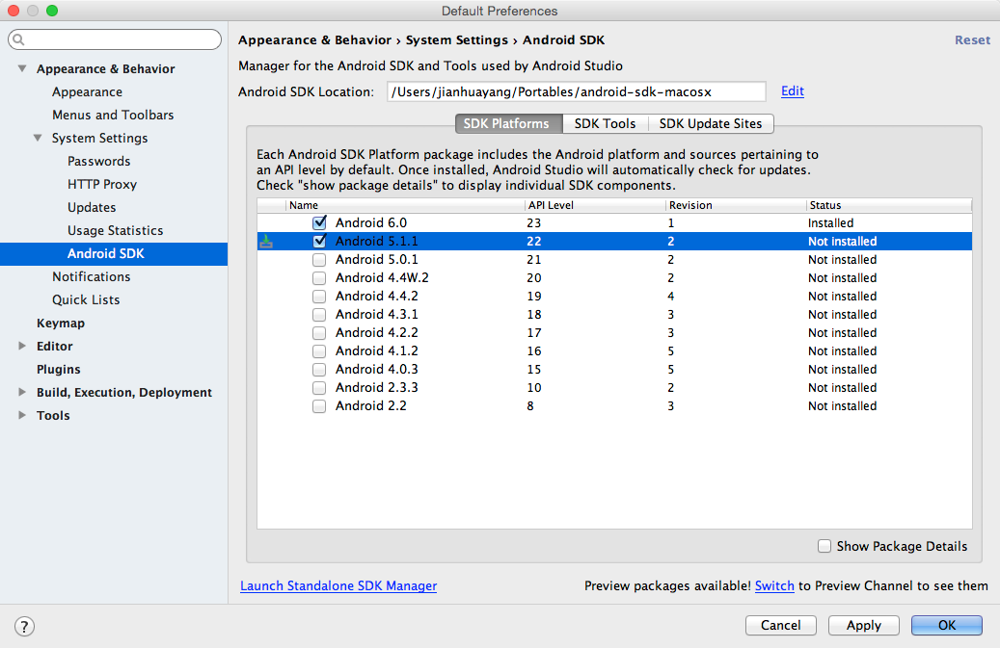
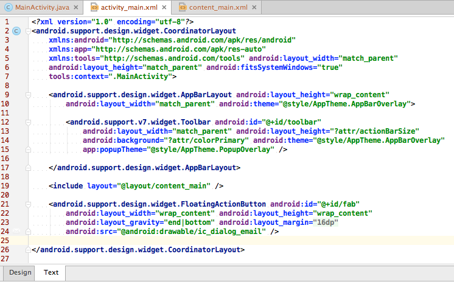
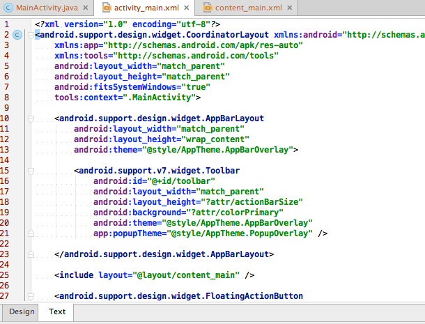
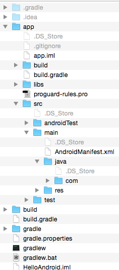

# Week 1 Android Studio

This is the 1st of a series of 11 excercises of Module 387COM at Coventry University. These excercises are designed to expose different aspects of Android programming to 3rd year Computer Science/Multimedia Computing students here at Coventry.

Before you start, you should have some experience with programming and a good knowledge of basic principles of OOP. Understanding of Java syntax is desired but not essential as we have some dedicated sessions for the language itself.

The expected outcomes after these 11 excercises are:

1. Demonstrate familiarity with the Java Programming language and the Android Studio.
2. Design applications suitable for Android devices.
3. Use the Android software development kit and emulator to develop applications for the Android platform.
4. Make use of the main modes of interaction available on a smartphone platform.

## Lab 1 Introduction to Android Studio

In this 1st lab, you'll find out the things you need to have become an Android developer. You'll also design and run your 1st Android app.

### What is Android?

First of all, let's ask a question - what is Android? Well, the answer depends on who you ask. There're several different levels to define Android: on the very deep level, it's a Linux operating system that controls a bunch of hardware devices. This is the same as any other operating systems such as Mac/Windows; on the very superficial level, Android are devices such as Samsung Galaxy; For us, Android developers, Android is an application runtime that we can develop codes which will turn into Dalvik virtual machines a.k.a. mobile apps.

Android has been around for a while, hence we have different versions. For each version of Android, we have a 'sweet' code name with the latest being 'Marshmallow', which is still in beta and not shown in the picture below.

Different versions of Android offer slightly different features, and also they have different market share. As the time of writing, KitKat (4.4) and Jelly Bean (4.1/4.2/4.3) are dominating. As you can imagine as new devices are coming to the market and old ones are graduatelly phasing out, this market share evolves over time. As a developer, you have to consider your targeting devices/platforms. We'll come to that later on.

> Click [here](https://source.android.com/source/build-numbers.html) for a list of Android version numbers and corresponding code names, [here](https://developer.android.com/about/dashboards/index.html) for an up-to-date distribution list. 

In this module we concentrate on the developing *native* apps using Java, Android SDK, and Android Studio exclusively. Native apps offer many advantages such as platform integration and speed. But you should be aware that there're quite a number of other tools that you can use to develop apps for Android devices. These include [PhoneGap](http://phonegap.com/) and [Xamarin](https://xamarin.com/) for example.

### Installation

You'll need the following to be an Android developer:

> If you're looking at this in ECM15, you can quickly glance through this section now as everything you need has been done for you. We have also requested that the same thing to be installed on every single machine in the EC building. But if you're looking at this on your own laptop, you need to read on carefully.

> I use Mac (most probably) to illustrate as you'll be using Macs in ECM15. But if you use Windows it shouldn't be too difficult to figure out the differences. If you get stuck, just ask!

1. Java JKD
2. Android Studio
3. Android SDK
4. A version of the Android system image
5. (optional) An Android device

A few words about Java: when you go to the [Java download page](http://www.oracle.com/technetwork/java/javase/downloads/index.html) click on the JDK, which will lead you to a diffent page to choose your platform. There you'll see two options, select the one without demos and samples as the size is smaller. Wondering the difference between JDK and JRE? Read [this](http://stackoverflow.com/questions/1906445/what-is-the-difference-between-jdk-and-jre).

Next, you'll need to [download](http://developer.android.com/sdk/index.html) and install Android Studio. Once you click the download button from the previous link, you'll be automatically redirect to the [Install Android Studio](http://developer.android.com/sdk/index.html) page. You can get some help from there if something goes wrong. Otherwise just choose all default settings. Note once it's installed, next time you open it it will probably ask for permissions to update. My advice is that don't update unless its really necessary, as least for the duration of the module. The reason being that configuring a working IDE for Android might take a considerable amount of time!

Once installed, click on the 'Configure' menu under 'Quick Start' tab, and then click 'SDK Manager', which will bring up the 'Android SDK' preference settings. Now check version 6.0 and version 5.1.1 and click apply to download the SDK. Once again, next time you open it it will probably ask for permissions to update - DON'T!

> This way of installing SDK is easy when you first get started. But the drawback is it takes a lot disk space. When you get your head around different SDK components, you might want to customize the installation using SDK Manager.

If you click the 'Launch Standaline SDK Manager', you'll see the standalone SDK manager window (yes, you guessed it!). Make sure that Intel Accelerator is installed. When you click the check box to install, what actually being installed is just the installation package. You'll need to find out where the installation package is and double click it. Read [this](https://software.intel.com/en-us/android/articles/installation-instructions-for-intel-hardware-accelerated-execution-manager-windows) to get more help.

When you finally write your own app you want to test and see how it works, that's why we need an Android system image and the optional Android device. From my own experience real devices run much faster than AVDs (Android virtual devices). Well, I guess it's not just myself, other people are complaining too, see [here](http://stackoverflow.com/questions/1554099/why-is-the-android-emulator-so-slow-how-can-we-speed-up-the-android-emulator). So I would encourage you to use your own device. If you don't have one, don't worry, an ADV has been installed together with Android Studio. We'll come back to that later on.

> I had previously been shown with someone's Mac where Android Studio cannot figure out the installation path of Java. If that happens to you, did you install all these stuff in the righ order? If you didn't, a 'brute force' fix would be to remove everthing and install in the correct order. But if you want to configure properly, Java is nomally installed under /Library/Java/JavaVirtualMachines/.

### Hello Android!

Follow the steps below to create and run your first Android app:

1. In Android Studio, click 'Start a new Android Studio project', and give it a name such as 'Hello Android'.
2. In 'Project location' settings select your desired location. Remember on the Macs in ECM15, you can save to your own 'H: drive'. And try not to save it to 'Downloads' folder, which is shared by everyone.
3. Next sreen asks you to choose minimum SDK. The default value should do. If you want to know more about this minimus SDK, click on 'Help me choose' and read the info that comes up. Does it look familiar?

 

4. Use all default settings until you see Finish. Click Finish to create your first Android project. Your screen should look similar to below:

 
 
5. You're ready to run the app you just created. Before you do that, let's check if you have an emulator or Android device attached. Click 'Tools'==>'Android'==>'AVD Manager' to show the AVD Manager. Make sure you have the default AVD installed. 

 If not, click 'Create Virtual Device' button to creat a new one. The following settings for an AVD seem to work well on my machine: Phone, Nexus 5, targetting at latest Android 6.0 with Google APIs. And most importantly, 'Use Host GPU' is checked. Remember in the previous section where I showed you that you need to install the Intell accelerator, here is why. Click 'Finish' and you'll have a new AVD.
 
5. Click 'Run'==> 'Run 'app'' to run the app you just created. In the window that pops up, click 'Launch emulator' and choose the desired AVD if you have more than one. BTW, you should only have 1 AVD running, otherwise the system will be rather slow. You will see HelloAndroid running in AVD similar to the one below.

 

6. If you are lucky of having an Android device attached to the computer you can use it for testing. But first of all you'll need to make your device debuggable. Use your device with Macs is a two-step process:

 * You need to enable Developer options. On Android 4.2 and higher, the Developer options screen is hidden by default. To make it visible, go to Settings ==> About phone and tap Build number seven times. 
 * Enable USB debugging on your device. On most devices running Android 3.2 or older, you can find the option under Settings ==> Applications ==> Development. On Android 4.0 and newer, it's in Settings ==> Developer options.

 If you want to use your device with a Windows machine, you'll have to install usb driver for your device. The driver can normally be downloaded from your phone maker's website. Check [here](http://developer.android.com/tools/device.html) if you get stuck.
 
 Now return to our Hello Android app, when I run it on my HTC it looks like the image below. Can you see any differences?
 
 

### Android Studio guided tour

Now it's time to go back to Android Studio and have a closer look at what we have done.

Android Studio is based on an Java IDE called IntelliJ. In fact, Google doesn't document Android Studio very well and sometimes you'll need to go to IntelliJ website to look for answers. The whole IDE window you saw earlier can be roughly divided into 5 areas:

> The image above is from Jetbrains [website](https://www.jetbrains.com/idea/help/guided-tour-around-intellij-idea-user-interface.html).

1. Menus and toolbars. This is pretty standard, but it gives you quick access to some common commands. For example, you can click the little green triangle to run your project. 
2. Navigation bar that tells you which file you're viewing and their relative position in the project.
3. The status bar shows various warning and information messages. Sometimes you see a message like 'gradle is running...' and this can take some time to disappear.
4. The editor. This is the main area you'll be working on.
5. Tool windows  - secondary windows that provide access to various specific tasks.

In the editor window, there're some important keyboard shortcuts that you need to be aware of. Double click 'activity_main.xml' to open it if it's not opened already. Click on the lower 'Text' tab to make sure you're viewing the text view. Press 'cmd' + 'a' to select everything, then press 'alt' + 'cmd' + 'l' to reformat it. Does it look nicer now?

> For a full list of useful shortcuts, check [here](http://developer.android.com/sdk/installing/studio-tips.html#KeyCommands)

Now take a look at the location you selected ealier to save the project. What you will see is that a bunch of files have been generated. Don't worry you don't need to know them all!

The most important ones, however, are being contained in app/src/main. Actually when I download samples from Android website, sometimes I just go into this folder and ignore the rest.

1. activity_main.xml. This is the XML layout file for the activity you added when you created the project with Android Studio. In simple words, in Android activity represent a single screen where your users can perform certain tasks. Thus this xml defines your first (and only) screen in your app. The file at the moment includes a TextView that displays the message "Hello world!" and a floating button.
2. MainActivity.java. This is the Java class that associates the xml layout file with different functions such as respond to button click. When you build and run the app, the Activity class starts the activity and loads the layout file that says "Hello World!".
3. AndroidManifest.xml. The manifest file describes the fundamental characteristics of the app and defines each of its components. For example, it defines if your app needs to access the GPS sensor.

> On the official [Android developer website](https://developer.android.com/tools/projects/index.html), you'll see full descriptions of different files.

We were talking about Android Studio, but why all of a sudden we turned to our harddrive? Here is why - when you look at the 'Project' tool window to the left, you'll see some files being displayed. And those are the files we've just talked about! In ths 'Project' mode, you'll see important files but not in their ordinary tree structure. There're several different modes in this tool window apart from the 'Android' mode. For example, if you choose 'Project' mode the window will display file trees that assemble what's available on your harddrive.

### Android vs iOS

When talking about Android, you need to know what else there are in the market. The advantages Android offers are: free, open, and complete. But it's very likely that in the future you'll be asked to develope an Android app as well as an iOS app. 

Technically speaking, the two big players in the mobile OS market i.e. Android and iOS share a lot of things in common and at the same time have lots of differences. As a developer you need to bare this in mind. One simple example is that Android has a physical or virtual back button, so there's no need to show a 'back' click on the screen. But for iOS we definitely need one.

## Lab 2 Debugging

Git common operations, logging, debugger's tool window

### Git version control

### Intents

### Debug

**Contents**

**Refs**

[Ref.[1]](#ref1) chapter 4/12

## Lab 3 Advanced topics

### SDK components

### Command line tools

### Design principles

### More Git

### Using Android samples

### Android Design Principles
What every Android developer should know is that design comes before coding! There’re certain rules to follow when designing an app, for example balance and proximity. With this regard, the official ‘Android Design Principles’ should be regarded as the ‘bible’. 

•	Balance is the harmonious arrangement of elements.
•	Proximity means that you should place elements that have a relationship close to each other. Web Design Introductory Concepts and Techniques

The above example, taken from ‘Mobile Design Pattern Gallery’ by Theresa Neil, gives us some idea of proper/improper use of layouts and colors. Keep in mind that most of these principles boil down to common sense, e.g. keep it simple and brief. As a group, have a discussion about the above design, and comments on what aspects of ‘Android Design Principles’ are being followed by each design.

