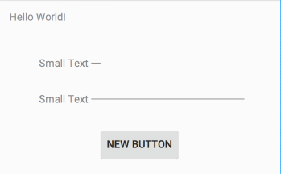
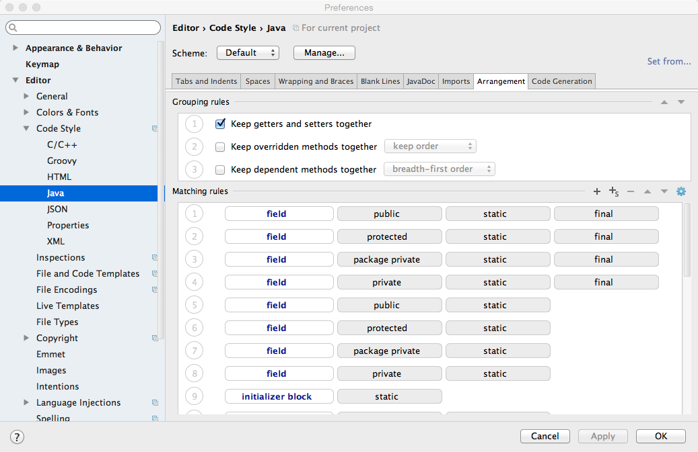
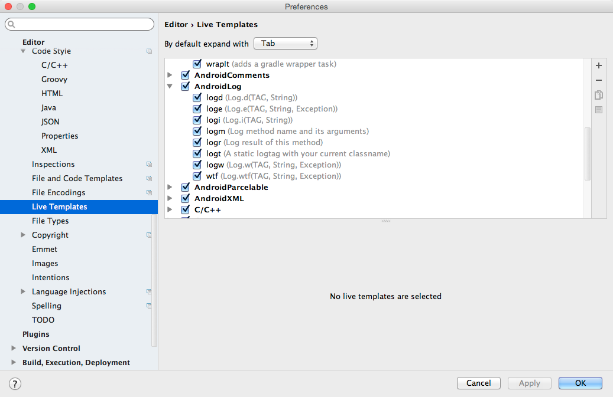
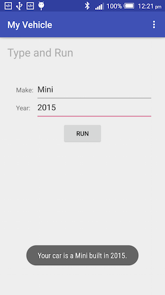
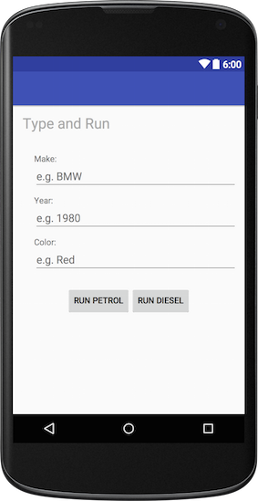

# The Java language

Hmm... Java... This is huge, where should we start?

In their latest book [Android Programming: The Big Nerd Ranch Guide (2nd Edition)](http://www.amazon.co.uk/dp/0134171454/ref=sr_1_1?s=books&ie=UTF8&qid=1443519722&sr=1-1&keywords=android+big+nerd+ranch) the authors claimed that:

> "... you need to be familiar with Java, including classes and objects, interfaces, listeners, packages, inner classes, anonymous inner classes, and generic classes. If these ideas do not ring a bell, you will be in the weeds by page 2 ..."

I couldn't agree more. So we'll start from there.

## Lab 1 Language concepts

In this first lab, you'll learn some basic language features and how Android Studio can be used to save your time.

### Design the interface

Follow steps below to create your app and initialize your layout file:

1. Create a new app and name it 'My Vehicle'.
2. If you see the red floating action button, read on. Otherwise you can skip this step.
 
 Under 'layout' folder you can see both 'activity_main.xml' and 'content_main.xml', open 'activity_main.xml' by double clicking on it. In the design view, click and delete the floating action button.
 
 
 
 Open MainActivity.java, delete following lines 
 
 ```java
         FloatingActionButton fab = (FloatingActionButton) findViewById(R.id.fab);
        fab.setOnClickListener(new View.OnClickListener() {
            @Override
            public void onClick(View view) {
                Snackbar.make(view, "Replace with your own action", Snackbar.LENGTH_LONG)
                        .setAction("Action", null).show();
            }
        });
 ```
 
3. Open 'content_main.xml', in design view, drap and drop the following widgets onto the graphical layout below 'Hello World!'. These need to be in the order of:
  * Small Text
  * Plain Text
  * Small Text
  * Numer
  * Button
 
 When you drag widges, in the graphical layout you'll see guidelines that show you which other widget is being used as the guide. This gives you some idea of where to place your widgets.
 
 
  
 
 
4. Double click on word 'Hello World!', a small window will pop up. Type in 'Type and Run' in the text field, and 'textView' in the id filed, and hit enter. You'll see the texts being displayed has changed to 'Type and Run'. We could do this for all widgets on the graphical layout. But normally we only drag and drop on a relatively rough scale, we fine-tune the layout in Text view.

5. Switch to the Text view, edit the layouts so it looks like the following:
 
 ```xml
 <TextView
        android:id="@+id/textView"
        android:layout_width="wrap_content"
        android:layout_height="wrap_content"
        android:text="Type and Run"
        android:textColor="@android:color/darker_gray"
        android:textSize="24sp" />

    <TextView
        android:id="@+id/labelMake"
        android:layout_width="wrap_content"
        android:layout_height="wrap_content"
        android:layout_alignLeft="@id/textView"
        android:layout_below="@+id/textView"
        android:layout_marginLeft="19dp"
        android:layout_marginTop="56dp"
        android:text="Make:"
        android:textAppearance="?android:attr/textAppearanceSmall" />

    <EditText
        android:id="@+id/inputMake"
        android:layout_width="800dp"
        android:layout_height="wrap_content"
        android:layout_alignBaseline="@id/labelMake"
        android:layout_marginLeft="5dp"
        android:layout_marginRight="10dp"
        android:layout_toRightOf="@id/labelMake"
        android:ems="10"
        android:hint="e.g. BMW" />

    <TextView
        android:id="@+id/labelYear"
        android:layout_width="wrap_content"
        android:layout_height="wrap_content"
        android:layout_alignLeft="@id/labelMake"
        android:layout_below="@id/labelMake"
        android:layout_marginTop="20dp"
        android:text="Year:"
        android:textAppearance="?android:attr/textAppearanceSmall" />

    <EditText
        android:id="@+id/inputYear"
        android:layout_width="800dp"
        android:layout_height="wrap_content"
        android:layout_alignBaseline="@id/labelYear"
        android:layout_alignLeft="@id/inputMake"
        android:layout_marginRight="10dp"
        android:ems="10"
        android:hint="e.g. 1980"
        android:inputType="number" />

 <Button
        android:id="@+id/buttonRun"
        android:layout_width="wrap_content"
        android:layout_height="wrap_content"
        android:layout_below="@+id/labelYear"
        android:layout_centerHorizontal="true"
        android:layout_marginTop="22dp"
        android:onClick="onButtonClick"
        android:text="Run" />
 ```
 
 You have done something similar to this (hopefully!) in last week's lab - editting different Android tags and attributes. We'll now have a closer look. And we'll look at them again later on during the module.
  
  * Views in Android (UI elements) are defined in XML using tags similar to HTML. Some tags have two parts i.e. openning and closing parts, such as RelativeLayout, which are usually container layouts. Some tags have just openning tags, and closing tags are replaced by a forward slice.
  * Attribuits have an 'android:' prefix, and the values are enclosed by double quotes.
  * A common layout attributes is id. Note the '@+id/' part before most id texts, the plus sign means that the id is being added to the system. In other words, there's no existing views with the same id. Otherwise the system will complain. Also note the 'match_parent' value in the RelativeLayout tag. This value replaces the old 'fill_parent' value.
  * Other common attributes inclue layout_width and layout_height. Possible values for these two are 'wrap_content' and 'match_parent'. The names explain themselves.
   
   > If you see an online example using 'fill_parent', you know it has been there for a while.
   
  * RelativeLayout is one of the two most important layouts in Android. To allign views in a RelativeLayout, you used attributes such as layout_height, layout_alignParentLeft, layout below. For a comprehensive list of attributes that can be used to control the positioning, click [here](http://developer.android.com/reference/android/widget/RelativeLayout.LayoutParams.html).
  
   > The reason that relative layout is important is that there're so many different screen sizes for Android. In a relative positioning system, once we know the origin point (top left corner) and the size of the view, we can determine its abosolute position. By contrast, iOS use absolute positioning as there'r only a limited number of screen sizes available.
    
    
    
  * Padding and margins in Android are the same as in CSS. The units used here are: dp (density-independent pixel) for everything except for fonts where sp (scale-independent pixel) is being used. For a thogrough explanation of the difference between dp, sp, pixel and scale-independence etc. click [here](http://developer.android.com/guide/practices/screens_support.html).

### Build the class

Following steps below to buid a new class:

1. In the Project tool window, switch to Android mode if it's not the current mode. Right click the package name under java folder, and select New ==> Java Class. Give it a name such as Vehicle.

 

2. Next, open Vehicle.java file and declare some variables:

 ```java
 public class Vehicle {
    private String make;
    private int year;
    private String message;
    public static int counter = 0;
}
 ```
 There're several things you need to know in the above codes:
 
  * If you come from Python background (as most of you do), you'll notice the type names such as String (capital S) and int. Unlike Python, Java is a strictly typed language, you need to decare variable types before using them.
  * Note access modifiers such as public and private. Public means everybody has access to that variable, and private is the complete opposite - nobody can. But if nobody has access rights, how can our Vehicle class use private variables? This is through getter and setter methods, as you'll find out later. There're also two other modifiers i.e. default and protected, do you know what those mean?
  * Also note the keyword static. This makes the counter variable a class variable that servers the whole class. By contrast, variables such as make is an instance variable (also called field). Instance variables are associated with an instance of the class i.e. objects.
  * The part 'counter = 0' is an assignment expression that sets counter to zero. All instance variables in Java have default values, and a default value for int is 0. So this step is not really necessary, but this is considered good coding practices. Local variables e.g. those appear in a for loop, have to be initialized before first use. This is the same as in Python.
  * Note the concluding semicolons at the end of each line. This makes the assignment expression a declaration statement. In Python, we don't normally use semicolons, but this is mandatory in Java. 

3. Right click anywhere between the openning and closing curly brackets, and select Generate ==> Constructor ==> Select None, this will automatically generate a contructor for you.
 ```java
 public Vehicle() {
    }
 ```
4. Type in the following lines of code into the constructor. As you type, Android Studio will give your some suggestions, you can use up/down arrow keys to navigate and tab key to select.

 ```java
    public Vehicle() {
        this.make = "Volvo";
        this.year = 2012;
        this.message = "This is the default message.";
    }
 ```
 
5. Use the generator to generate two other constructors, so your code looks like this
 ```java
    public Vehicle(String make, int year) {
        this.make = make;
        this.year = year;
        this.message = "Your car is a " + make + " built in " + year + ".";
    }

    public Vehicle(String make) {
        this();
        this.make = make;
        message = "You didn't type in year value.";
    }
 ```
 The reason we need more than one constructor is that the user may not provide all the info we need. In case this happens, we'll use the default values stored in our class. Constructors in Java are public methods with the same name as class without return types. Normally methods in Java are defined including the following components：
  * Modifiers. In the case of constructors, these need (not must) to be public.
  * Return types. Ordinary methods must have return types e.g. String and a return statement in its method body. For constructors, this is not required.
  * Name. This is needless to say. For constructors though, this must be the same as class name.
  * Parameter list. In our examples this is a single parameter 'String make' or parameters seperated by comma 'String make, int year'.
  * A method's signature is the method's name and the parameter types. For example, the signature of the last constructor is Vehicle(String make).
  * In our simple example above, we overloaded the constructor methods. By **overloading** I meant methods with the same name but different input parameters.
 
 Note the 'this' keyword in the second constructor 'this.make = make;'. In this case, this.make refers to the instance variable in the class, while make refers to the parameter of the method.
 
6. Use Android Studio's code generator to generate a get method for message.

 ```java
    public String getMessage() {
        return message;
    }
 ```
7. Click anywhere within the class definition, then click Code ==> Override Methods ==> toString, this will generate an toString method overriding the toString method in class Object, which is the superclass of all classes in Java. Replace super.toString() with message. 

 ```java
    @Override
    public String toString() {
        return message;
    }
 ```
 Note the @Override part at the beginning of the line, this is called annotations. When Java compiler sees it, it double-checks that the subclass is overriding a method with the same signature in the superclass. By **overriding** I meant a method with the same signature. If this is not the case, the compiler will complain. There're quite a number of annotations in Java, but this Override is what you see the most in Android.
 
8. Insert the following within the class definition:

 ```java
 private void count(){
    this.counter++;
 }
 ```
 This method increase the internal counter each time it is called.

9. Insert the count() method into the 'non-default' constructors, so that each time the constructor is called the counter will increase.

 ```java
    public Vehicle(String make, int year) {
        this.make = make;
        this.year = year;
        this.message = "Your car is a " + make + " built in " + year + ".";
        count();
    }

    public Vehicle(String make) {
        this();
        this.make = make;
        message = "You didn't type in year value.";
        count();
    }
 ```
10. Now you need to comment your codes to increase its readability. There are three types of comments in Java
  1. A line comment starts with //, it is inserted when you press 'cmd' + '/' together
   ```java
    // the default constructor
    public Vehicle() {
    ...
    }
   ```
  2. A block comment is in between <span>/&#42;</span> and */, it's inserted when you press 'alt' + 'cmd' + '/' together
   ```java
    /*
     * This constructor takes to parameters.
    */
    public Vehicle(String make, int year) {
    ...
    }
   ```
  3. Documentation comments are a special kind of comments that are processed by the [Javadoc tool](http://www.oracle.com/technetwork/articles/java/index-jsp-135444.html). It begins with <span>/&#42;&#42;</span> and finishes with <span>&#42;/</span>. It's used to automatically generate documentations. The system has already generated Javadoc for you at the begining of the file with your user name and date, you can insert author and version info there.
  
      ```java
      /**
      * Created by jianhuayang on 25/09/15.
      * @author jianhuayang
      * @version 1.0
      */
      public class Vehicle {
      ...
      }
      ```
      You can also insert the following Javadoc for your constructor
   ```java
    /**
     * The constructor that takes only the make of the car.
     * @param make the make of your car.
    */
    public Vehicle(String make) {
    ...
    }
   ```
11. Now you have everything you need, but it may not be in a nice readable order. What Android Studio offers here is a rearrangement function. Click Code ==> Rearrange Code to see if it makes any differences. The rules Android Studio uses can be configured using Preferences ==> Editor ==> Code Style ==> Java

 

### Linking layout with behavior

Follow steps below to create an onButtonClick method that responds to user click

1. Open MainActivity.java, insert the following variables just after MainActivity class declaration

 ```java
    private static final String TAG = "MyVehicleActivity";
    private EditText editTextMake;
    private EditText editTextYear;
 ```
2. Create a method called onButtonClick
 ```java
    public void onButtonClick(View view) {
        editTextMake = (EditText) findViewById(R.id.inputMake);
        editTextYear = (EditText) findViewById(R.id.inputYear);
        String make = editTextMake.getText().toString();
        String strYear = editTextYear.getText().toString();

        Vehicle vehicle;
        if (strYear.matches("")) {
            vehicle = new Vehicle(make);
        } else {
            int intYear = Integer.parseInt(strYear);
            vehicle = new Vehicle(make, intYear);
        }
        Toast.makeText(getApplicationContext(), vehicle.getMessage(), Toast.LENGTH_SHORT).show();
        Log.d(TAG, "User clicked " + Vehicle.counter + " times.");
        Log.d(TAG, "User message is \"" + vehicle + "\".");
    }
 ```
 
  What this code does is that it collects the make and year the user has typed, and then it creates a vehicle object and pops up a message. In case the user doesn't supply a year of their car, it'll use the default settings. In the meanwhile, the app records the number of times the button has been clicked. And this info goes to system log. Something you need to note in the codes above:
  
    * (EditText) is an explicit type cast (type convertion). This is required as the return type of findViewById is View, which is the superclass of most UI elements in Android.
    * The getText().toString() will return a String. A simple getText() won't work as the return type for the method is Editable.
    * Toast in Android is a small pop-up message. The signature for the method we used is `public static Toast makeText (Context context, CharSequence text, int duration)`. Click [here](http://developer.android.com/reference/android/widget/Toast.html) for details of this method.
    
    * You have seen Log.d before. There're another way of inserting Log.d into your class. Move you cursor to the position where you want to insert, press 'cmd' + 'j' together, a small drop-down menu will popup. This drop-down is different from normal Android Studio suggestions. You can now use your up/down key to select logm and then hit enter.
    
        What you just did is you inserted a so-called 'live template' into your codes. There're other templates available in Android Studio, and you can also define your own templates
        
        

3. Now your are ready to test-drive your new app. Type in the make and year of your car and click RUN to see what happens. You can also leave out the year box blank to see if the app gives you a default year. Check the system log to see how many times you've clicked.

 

 

## Lab 2 Classes and objects

A single class can do quite a lot. But very often you want more than one classes. In this second lab, we'll look at how different classes interact with each other.

### Design the interface

Follow steps below to create a new app and design the layout:

1. Create a new app called 'My Car'. Delete the floating action button in the xml file if you have one, and also delete the corresponding listener in MainActivity.java. This step is the same as in the previous app.
2. Within this app, create a new Java class called Vehicle. Copy the source codes from the previous Vehicle class over.

 > You can continue working on the previous app if you wish. In this GitHub folder you'll see two apps for illustration purposes.
 
3. Open content_main.xml and replace RelativeLayout with LinearLayout in both openning and closing tags. LinearLayout is another important layout group where widgets within it are stacked on top of one another, either horizontally or vertically.
4. Add the following attribute into LinearLayout openning tag 'android:orientation="vertical'. There're two types of orientations available in a LinearLayout, either vertical or horizontal.
5. Drag and drop the following widgets onto the graphical layout, in any order: three Small Texts, two Plain Texts, one Number, one LinearLayout (Horizontal), and two Buttons. Try to arrange the widgets so that it looks like the following. You may not be able to make your paddings/margins match exactly the same as in the image, but at least you need to make sure the UI elements are in the same order.

 
 
6. Switch to the text view, and edit the xml code so it looks like

 ```xml
     <TextView
        android:id="@+id/textView"
        android:layout_width="match_parent"
        android:layout_height="wrap_content"
        android:text="Type and Run"
        android:textColor="@android:color/darker_gray"
        android:textSize="24sp" />

    <TextView
        android:id="@+id/labelMake"
        android:layout_width="wrap_content"
        android:layout_height="wrap_content"
        android:layout_marginLeft="19dp"
        android:layout_marginTop="36dp"
        android:text="Make:"
        android:textAppearance="?android:attr/textAppearanceSmall" />

    <EditText
        android:id="@+id/inputMake"
        android:layout_width="800dp"
        android:layout_height="wrap_content"
        android:layout_marginLeft="19dp"
        android:layout_marginRight="20dp"
        android:ems="10"
        android:hint="e.g. BMW" />

    <TextView
        android:id="@+id/labelYear"
        android:layout_width="wrap_content"
        android:layout_height="wrap_content"
        android:layout_marginLeft="19dp"
        android:layout_marginTop="10dp"
        android:text="Year:"
        android:textAppearance="?android:attr/textAppearanceSmall" />

    <EditText
        android:id="@+id/inputYear"
        android:layout_width="800dp"
        android:layout_height="wrap_content"
        android:layout_marginLeft="19dp"
        android:layout_marginRight="20dp"
        android:ems="10"
        android:hint="e.g. 1980"
        android:inputType="number" />

    <TextView
        android:id="@+id/labelColor"
        android:layout_width="wrap_content"
        android:layout_height="wrap_content"
        android:layout_marginLeft="19dp"
        android:layout_marginTop="10dp"
        android:text="Color:"
        android:textAppearance="?android:attr/textAppearanceSmall" />

    <EditText
        android:id="@+id/inputColor"
        android:layout_width="800dp"
        android:layout_height="wrap_content"
        android:layout_marginLeft="19dp"
        android:layout_marginRight="20dp"
        android:ems="10"
        android:hint="e.g. Red" />

    <LinearLayout
        android:layout_width="match_parent"
        android:layout_height="wrap_content"
        android:layout_marginTop="22dp"
        android:gravity="center"
        android:orientation="horizontal">

        <Button
            android:id="@+id/buttonRunPetrol"
            android:layout_width="wrap_content"
            android:layout_height="wrap_content"
            android:gravity="center_vertical"
            android:onClick="onButtonClick"
            android:text="Run Petrol" />

        <Button
            android:id="@+id/buttonRunDiesel"
            android:layout_width="wrap_content"
            android:layout_height="wrap_content"
            android:gravity="center_vertical"
            android:onClick="onButtonClick"
            android:text="Run Diesel" />

    </LinearLayout>
 ```
 Your have seen most of the widgets and attributes before, but ther're a couple new ones:
  * A LinearLayout is being contained by another LinearLayout. This is possible and in fact the right thing to do. The reason being that this is the most effective way of changing LinearLayout orientation on a local area.
  * The gravity attribute is new here. This is not to be confused with layout_gravity. Gravity specifies the alignment of all the child elements; while layout_gravity defines how the view itself should be positioned within its enclosing parent layout.
   > An analog of this is `android:layout_gravity` = `float` in CSS, and `android:gravity` = `text-align` in CSS. For more explanations click [here](http://stackoverflow.com/questions/3482742/gravity-and-layout-gravity-on-android).

### OOP principles

Go back to Vehicle.java, we need to prepare the class to make it ready.

1. Generate a setter method for message instance variable.

 ```java
 public void setMessage(String message) {
        this.message = message;
 }
 ```
2. Insert an interface into the class, so that this is an inner interface.
 ```java
 interface controllerable {
        void control();
 }
 ```
 Interface is like a class, it defines a set of *empty* methods. Any non-abstract classes that implement the interface must provide a method body for each of these methods. In this sense, we often call an interface as a 'contract' - it defines what the class is capable of i.e. its methods. 
 
 > Interface in Java is so important that there's a principle called 'programming to an interface'. Click [here](http://stackoverflow.com/questions/383947/what-does-it-mean-to-program-to-an-interface) for details.
 
 Note the method defined in the interface has no curly brackets and is terminated with a semicolon. This is different from ordinary method.
 
3. Click Code ==> Rearrange Code and Code ==> Reformat Code to make it look nicer.

Now we're ready to explore inheritance in java:

1. Create a new class called 'Car', and delete the public mofifier. By removing the public modifier, we make the class default. That means only classes with the same package can access it.
 > We don't have to remove 'public', but I want to make sure both subclasses have the same access level. The important thing to remember is that in Java there can only be one public class per .java file.
 
2. Create another class called 'Diesel'. Make sure both Car and Diesel extends Vehicle. In addition, make sure Diesel implements Vehicle.controllerable.

 You'll see that the Diesel class signature is highlighted with red underline. The means there's something wrong with it. Move your mouse over and read the system message that says you need to implement the control() method.
 
 ```java
 class Car extends Vehicle {
 }
 
 class Diesel extends Vehicle implements Vehicle.controllerable {
 
    @Override
    public void control() {
        
    }
 }
 ```
3. Insert the following codes into your Car class file_exists
 
 ```java
 class Car extends Vehicle{

    private String color;
    public Car(String make, int year, String color){
        super(make, year);
        this.color = color;
        setMessage(getMessage() + " I like your shining " + color + " color.");
    }
 }
 
 class Diesel extends Vehicle implements Vehicle.controllerable{

    private String type;

    public Diesel(String make, int year){
        super(make, year);
        this.type = "Diesel";
    }

    @Override
    public void control() {
        setMessage(super.getMessage() + " Emission is under control.");
    }

    @Override
    public String getMessage() {
        control();
        return super.getMessage();
    }
 }
 ```
 
 What this code does is that we create two subclasses of Vehicle, each has slightly different structure i.e.viariables/methods. Car has an additional field called color, and Diesel has one called type. In addition, Diesel has an additional control() method by implementing the controllerable interface. The idea is that by looking at the class signature i.e. `class Diesel extends Vehicle implements Vehicle.controllerable` we know that the Diesel class is capable of doing methods defined in `controllerable`.
 
 If you're used to interpretted languages such as Python, the codes above might cause some confusion:
 
    * 'extends' defines a relationship between superclass (Vehicle) and subclass (Car). Subclass inherits all non-private instance variables and methods. That is why we didn't declare anything such as make/year but we can still use them.
    * In subclasses we can define additional instance variables or methods such as color for Car.
    * 'implements' defines a relationship between a class (Diesel) and an interface (Vehicle.controllerable). The interface method the class implements must be public. In our case, we must have `public void control()` and it cannot be `void control()`
    * Note the super keyword in the control() method, this is similar to 'this' keyword -- i.e. it refers to superclass in the hierarchy. If we don't user the super keyword in our case `super.getMessage()`, we'll end up with infinite loops as the default behavior is to call `this.getMessage()`.
    
        > You might want to remove 'super' in control() method later on and run your app to see what happens.
    
4. Next, you need to link the layout with classes. Go back to MainActivity.java and insert variable declarations immediately after class declaration.
 
 ```java
    private static final String TAG = "MyCarActivity";
    private EditText editTextMake;
    private EditText editTextYear;
    private EditText editTextColor;
 ```

 And then insert an onButtonClick method
 
 ```java
    public void onButtonClick(View view) {
        editTextMake = (EditText) findViewById(R.id.inputMake);
        editTextYear = (EditText) findViewById(R.id.inputYear);
        editTextColor = (EditText) findViewById(R.id.inputColor);
        String make = editTextMake.getText().toString();
        String strYear = editTextYear.getText().toString();
        int intYear = Integer.parseInt(strYear);
        String color = editTextColor.getText().toString();

        Vehicle vehicle;
        switch (view.getId()) {
            case R.id.buttonRunPetrol:
                vehicle = new Car(make, intYear, color);
                break;
            case R.id.buttonRunDiesel:
                vehicle = new Diesel(make, intYear);
                break;
            default:
                vehicle = new Vehicle();
                break;
        }

        if (Vehicle.counter == 5) {
            vehicle = new Vehicle() {
                @Override
                public String getMessage() {
                    return "You have pressed 5 times, stop it!";
                }
            };
        }

        Toast.makeText(getApplicationContext(), vehicle.getMessage(), Toast.LENGTH_SHORT).show();
        Log.d(TAG, "User clicked " + Vehicle.counter + " times.");
        Log.d(TAG, "User message is \"" + vehicle + "\".");
    }
 ```
 The idea of the code above is that depending on which button is being clicked we generate two different type of objects i.e. either Car or Diesel. Hence we'll show our user different messages. If our user clicked 5 times, it'll pop back a totally different message warning they need to stop. The part of code you need to pay attention to is listed below. This snippet creates an anonymous inner class with an overiding method and assign it to variable vehicle. We could create an subclass here but the biggest advantage of anonymous inner class is that it makes your code more concise and tidy. It's vital you understand the syntax here as you'll see this a lot in following weeks.
 
 ```java
 vehicle = new Vehicle() {
                @Override
                public String getMessage() {
                    return "You have pressed 5 times, stop it!";
                }
 };
 ```

5. Insert `android:onClick="onButtonClick"' for both buttons in 'content_main.xml'.


### Java naming conventions
google java style

### More on Git

## Lab 3 Advanced topics

### pattern
Delegation 

https://www.jetbrains.com/idea/help/replace-inheritance-with-delegation.html
singleton
### uml

### advanced language features