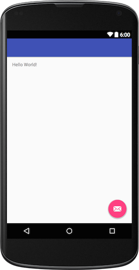
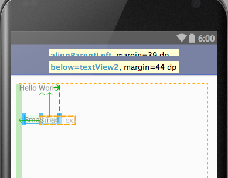
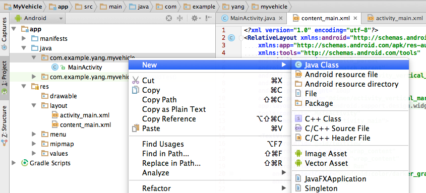

# The Java language

Hmm... Java... This is huge, where should we start?

In their latest book [Android Programming: The Big Nerd Ranch Guide (2nd Edition)](http://www.amazon.co.uk/dp/0134171454/ref=sr_1_1?s=books&ie=UTF8&qid=1443519722&sr=1-1&keywords=android+big+nerd+ranch) the authors claimed that:

> "... you need to be familiar with Java, including classes and objects, interfaces, listeners, packages, inner classes, anonymous inner classes, and generic classes. If these ideas do not ring a bell, you will be in the weeds by page 2 ..."

I couldn't agree more. So we'll start from there.

## Lab 1 Language concepts

In this first lab, you'll learn some basic language features and how Android Studio can be used to save your time.

### Design the interface

Follow steps below to create your app and initialize your layout file:

1. Create a new app and name it 'My Vehicle'.
2. If you see the red floating action button, read on. Otherwise you can skip this step.

 Under 'layout' folder you can see both 'activity_main.xml' and 'content_main.xml', open 'activity_main.xml' by double clicking on it. In the design view, click and delete the floating action button.
 
 
 
 Open MainActivity.java, delete following lines 
 
 ```java
         FloatingActionButton fab = (FloatingActionButton) findViewById(R.id.fab);
        fab.setOnClickListener(new View.OnClickListener() {
            @Override
            public void onClick(View view) {
                Snackbar.make(view, "Replace with your own action", Snackbar.LENGTH_LONG)
                        .setAction("Action", null).show();
            }
        });
 ```

3. Open 'content_main.xml', in design view, drap and drop the following widgets onto the graphical layout below 'Hello World!'. These need to be in the order of:
  * Small Text
  * Plain Text
  * Small Text
  * Numer
  * Button

 When you drag widges, in the graphical layout you'll see guidelines that show you which other widget is being used as the guide. This gives you some idea of where to place your widgets.
 
 
  
 
 
4. Double click on word 'Hello World!', a small window will pop up. Type in 'Type and Run' in the text field, and 'textView' in the id filed, and hit enter. You'll see the texts being displayed has changed to 'Type and Run'. We could do this for all widgets on the graphical layout. But normally we only drag and drop on a relatively rough scale, we fine-tune the layout in Text view.

4. Switch to the Text view, edit the layouts so it looks like the following:

```xml
    <TextView
        android:id="@+id/textView"
        android:layout_width="wrap_content"
        android:layout_height="wrap_content"
        android:text="Type and Run"
        android:textColor="@android:color/darker_gray"
        android:textSize="24sp" />

    <TextView
        android:id="@+id/labelMake"
        android:layout_width="wrap_content"
        android:layout_height="wrap_content"
        android:layout_alignLeft="@id/textView"
        android:layout_below="@+id/textView"
        android:layout_marginLeft="19dp"
        android:layout_marginTop="56dp"
        android:text="Make:"
        android:textAppearance="?android:attr/textAppearanceSmall" />

    <EditText
        android:id="@+id/inputMake"
        android:layout_width="800dp"
        android:layout_height="wrap_content"
        android:layout_alignBaseline="@id/labelMake"
        android:layout_marginLeft="5dp"
        android:layout_marginRight="10dp"
        android:layout_toRightOf="@id/labelMake"
        android:ems="10"
        android:hint="e.g. BMW" />

    <TextView
        android:id="@+id/labelYear"
        android:layout_width="wrap_content"
        android:layout_height="wrap_content"
        android:layout_alignLeft="@id/labelMake"
        android:layout_below="@id/labelMake"
        android:layout_marginTop="20dp"
        android:text="Year:"
        android:textAppearance="?android:attr/textAppearanceSmall" />

    <EditText
        android:id="@+id/inputYear"
        android:layout_width="800dp"
        android:layout_height="wrap_content"
        android:layout_alignBaseline="@id/labelYear"
        android:layout_alignLeft="@id/inputMake"
        android:layout_marginRight="10dp"
        android:ems="10"
        android:hint="e.g. 1980"
        android:inputType="number" />

    <Button
        android:id="@+id/buttonRun"
        android:layout_width="wrap_content"
        android:layout_height="wrap_content"
        android:layout_below="@+id/labelYear"
        android:layout_centerHorizontal="true"
        android:layout_marginTop="22dp"
        android:onClick="onButtonClick"
        android:text="Run" />
 ```
 You have done something similar to this (hopefully!) in last week's lab - editting different Android tags and attributes. We'll now have a closer look. And we'll look at them again later on during the module.
  
  1. Views in Android (UI elements) are defined in XML using tags similar to HTML. Some tags have two parts i.e. openning and closing parts, such as RelativeLayout, which are usually container layouts. Some tags have just openning tags, and closing tags are replaced by a forward slice.
  2. Attribuits have an 'android:' prefix, and the values are enclosed by double quotes.
  4. A common layout attributes is id. Note the '@+id/' part before most id texts, the plus sign means that the id is being added to the system. In other words, there's no existing views with the same id. Otherwise the system will complain. Also note the 'match_parent' value in the RelativeLayout tag. This value replaces the old 'fill_parent' value.
  5. Other common attributes inclue layout_width and layout_height. Possible values for these two are 'wrap_content' and 'match_parent'. The names explain themselves.
  > If you see an online example using 'fill_parent', you know it has been there for a while.
  6. RelativeLayout is one of the two most important layouts in Android. To allign views in a RelativeLayout, you used attributes such as layout_height, layout_alignParentLeft, layout below. For a comprehensive list of attributes that can be used to control the positioning, click [here](http://developer.android.com/reference/android/widget/RelativeLayout.LayoutParams.html).
  > The reason that relative layout is important is that there're so many different screen sizes for Android. In a relative positioning system, once we know the origin point (top left corner) and the size of the view, we can determine its abosolute position. By contrast, iOS use absolute positioning as there'r only a limited number of screen sizes available.
  
 
 
  7. Padding and margins in Android are the same as in CSS. The units used here are: dp (density-independent pixel) for everything except for fonts where sp (scale-independent pixel) is being used. For a thogrough explanation of the difference between dp, sp, pixel and scale-independence click [here](http://developer.android.com/guide/practices/screens_support.html).

### Build the class

Following steps below to buid a new class:

1. In the Project tool window, switch to Android mode if it's not the current mode. Right click the package name under java folder, and select New ==> Java Class. Give it a name such as 

 


Data type, variable, expressions, identifiers, statements, comments

### Programming aids in Android Studio

## Lab 2 Classes and objects


### Classes, constants, methods, constructors, modifiers, inheritence

###

### Java naming conventions
google java style

### More on Git

## Lab 3 Advanced topics

### pattern
Delegation 

https://www.jetbrains.com/idea/help/replace-inheritance-with-delegation.html
singleton
### uml

### advanced language features