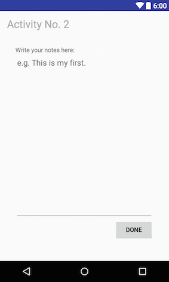
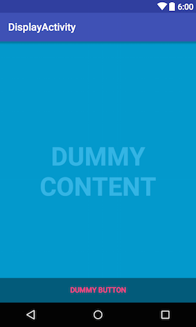
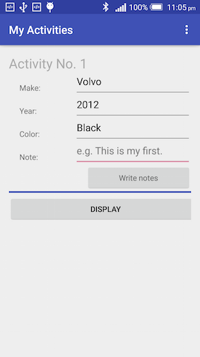
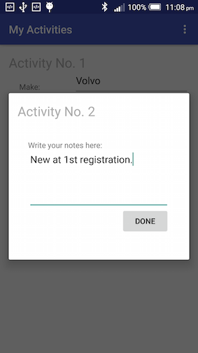
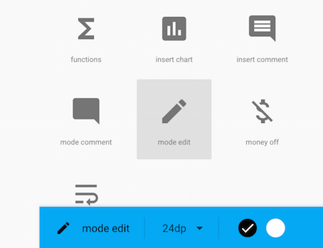
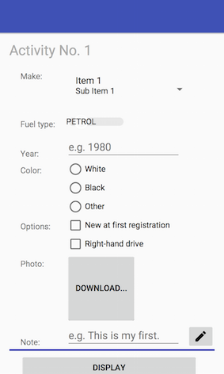

# Simple Views and Layouts

By now you should be familiar with a 'single-page application' in Android. That is, an app that runs within a single Activity (capital 'A'). You should have some expereience using LinearLayouts/RelativeLayouts, providing systems resources for different screen sizes etc. This week, we'll look at Activity lifecycle and how to pass data between Activities. Also, we'll examine some more layouts and widgets. 

## Lab 1 UI design

Before we go into details of what each individual widget is capable of doing, we need to have a big picture of what Android has to offer. But even before we do that, let's have a look at a popular design pattern called MVC (Model-View-Controller).

### MVC pattern

The MVC pattern, which plays a vital role in modern application programming, assigns objects in an application one of three roles: model, view, or controller:

- *Model*: Model is your data structure. It holds the relationship witin your data. Model objects encapsulate the data specific to an application and define the logic and computation that manipulate and process that data. 
- *View*: A view object is an object in an application that users can see. A view object knows how to draw itself and can respond to user actions.
- *Controller*: A controller object acts as an intermediary between one or more of an application’s view objects and one or more of its model objects. In Android, a controller is typically a subclass of Activity, Fragment, or Service.


In Adroid, especially for small-scale apps, it's often not easy to distinguish roles within the MVC pattern. But the benefits of MVC is obvious - it seprates the front-end and back-end, and make it easier to reuse your classes.

### Design principles

On the [official Android website](http://developer.android.com/design/get-started/principles.html) Google lists following principles you need to follow when designing your app, but most of them boils down to common sense.

- *Enchant me*: 'your app should strive to combine beauty, simplicity and purpose to create a magical experience that is effortless and powerful' (quoted direcitly from Google).
- *Simplify my life*: make your app easy to navigate, easy to use, easy to understand.
- *Make me amazing*: provide visual hints and/or default values for your app, break big tasks into smaller steps.

Google released the new [Material Design](https://www.google.com/design/spec/material-design/introduction.html) with android 5.0 Lollipop, which provides detailed guidlines for visual, motion etc. and covers almost everything one can think of in app design. Here I list some common requirements that you should try to meet and pitfall s that you should try to avoid in your app. Detailed requirements can be found in Material Design documentation.

- *Animation*: Changes in acceleration or deceleration should be smooth across the duration of an animation.
- *Style*: Uer system recommended color, icons, meaningful and genuine images. Use concise and simple languages.
- *Layout*: Design to suit different devices and screen-sizes. Try to avoid slicing up the interface into too many regions like in the following

    


- *Components*: Requirements were layed in Material Design for different UI components such as buttons or menus. Some of these requirements are very specific, e.g. button height need to be 36dp in a dialog. Some other requirements tend to be more general, e.g the rule that states don't use flat buttons in UIs where they would be difficult to see.
- *Pattern and Usability*: Material Design has guidelines for different senarios which is referred to as 'patterns'. For example, launch screens can be either placeholder UI or branded launch. Of course you can implement anything you wish, but I'd go for one of these two for your app. 

The above is a really brief 'abstract' of the Material Design documentation. The important things to remember is, if in doubt, check with the official documentation.

### Activity lifecycle

Now we'll start exploring the Activity lifecycle. As we know already, in Android each Activity is (normally) associated with a layout xml file. Before and after the layout becomes visible/disappear on the screen the system has to create or destroy the Activity object by calling some callback methods such as `onCreate`. The whole process i.e. lifecycle of an Activity involes several different stages and callback methods.

Following steps below to create a new project and insert some overriding methods:

1. Create a new project called 'My Activities'.
2. Insert the following code into the class body of 'MainActivity.java'.
    ```java
    private static final String TAG_LIFECYCLE = "TagLifecycle";
    ```
3. Insert teh following into the `onCreate` method
    ```java
    Log.d(TAG_LIFECYCLE, "In the onCreate() event");
    ```
4. Insert the following into the class body:
    ```java
    @Override
    public void onStart() {
        super.onStart();
        Log.d(TAG_LIFECYCLE, "In the onStart() event");
    }

    @Override
    public void onRestart() {
        super.onRestart();
        Log.d(TAG_LIFECYCLE, "In the onRestart() event");
    }

    @Override
    public void onResume() {
        super.onResume();
        Log.d(TAG_LIFECYCLE, "In the onResume() event");
    }

    @Override
    public void onPause() {
        super.onPause();
        Log.d(TAG_LIFECYCLE, "In the onPause() event");
    }

    @Override
    public void onStop() {
        super.onStop();
        Log.d(TAG_LIFECYCLE, "In the onStop() event");
    }

    @Override
    public void onDestroy() {
        super.onDestroy();
        Log.d(TAG_LIFECYCLE, "In the onDestroy() event");
    }
    ```
5. Start your AVD or connect you phont/tablet, and run the app. In logcat, use 'TagLifecycle' to filter the outputs. Now try to answer the following:

    * When you first start the app, which methods were called?
    * If you press 'back' button, which methods are called?
    * Now, press the app icon on your phone to start again, which methods are called?
    * If you now press the 'home' button, which methods are called?
    * Now press the app icon, what happened? What does it mean?

Talking about Activity lifecyle, there're two diagrams you have to know well:


----------------divider---------------------------------------------------


The upper image depicts all callback methods an Activity has to go through from the start of its life until the end. Even though there're so many different callbacks, there're only three constant states, as shown in the lower image:

- *Resumed*: The activity is in the foreground of the screen and has user focus.
- *Paused*: Another activity is in the foreground and has focus, but this one is still visible.
- *Stopped*: The activity is completely obscured by another activity.

The other two states in the lower image above i.e. created and started are transient and the system quickly moves from them to the next state by calling the next lifecycle callback method.

Associated with these callback methods are what we need to implement within them. For this, [the official guide](http://developer.android.com/guide/components/activities.html) is thorough and comprehensive. Please spend time to read. The two most important things that are ofthen confused by our students are:

1. The 'home' button doesn't destroy your activity. The system will remember your app's current state. So press 'home' button and then press your app icon to restart your app is **NOT** a way to show data persistence.
2. If the system must recover memory in an emergency, `onStop()` and `onDestroy()` might not be called. Again, to save data for the sake of persistence you'll need to do it in `onPause()`.

### FrameLayout, ScrollView, TableLayouts 

Following steps below to insert two more activities and prepare the layout file for later use.

1. In the Project tool window, right-click app, select New ==> Activity ==> Blank Activity, name it 'NoteEditingActivity'.
2. Create another new FullscreenActivity and name it 'DispalyActivity'.
3. Open activity_display.xml, you'll see the root tag is **FrameLayout**. The FrameLayout is a placeholder on screen that you can use to display a single view. Views that you add to a FrameLayout are always anchored to the top left of the layout.
4. Open content_main.xml (or activity_main.xml if you don't have content_main.xml), replace its content with the following:

    ```xml
    <?xml version="1.0" encoding="utf-8"?>

    <ScrollView xmlns:android="http://schemas.android.com/apk/res/android"
    xmlns:app="http://schemas.android.com/apk/res-auto"
    xmlns:tools="http://schemas.android.com/tools"
    android:layout_width="match_parent"
    android:layout_height="match_parent"
    android:paddingBottom="@dimen/activity_vertical_margin"
    android:paddingLeft="@dimen/activity_horizontal_margin"
    android:paddingRight="@dimen/activity_horizontal_margin"
    android:paddingTop="@dimen/activity_vertical_margin"
    app:layout_behavior="@string/appbar_scrolling_view_behavior"
    tools:context=".MainActivity"
    tools:showIn="@layout/activity_main">

    <TableLayout
        android:layout_width="match_parent"
        android:layout_height="match_parent"
        android:stretchColumns="1">

        <TableRow
            android:layout_width="match_parent"
            android:layout_height="match_parent">

            <TextView
                android:id="@+id/textView"
                android:layout_width="1900dp"
                android:layout_height="wrap_content"
                android:layout_column="0"
                android:layout_span="2"
                android:text="Activity No. 1"
                android:textColor="@android:color/darker_gray"
                android:textSize="24sp" />
        </TableRow>

        <TableRow>

            <TextView
                android:id="@+id/labelMake"
                android:layout_width="wrap_content"
                android:layout_height="wrap_content"
                android:layout_marginLeft="19dp"
                android:layout_marginTop="10dp"
                android:width="80dp"
                android:text="Make:"
                android:textAppearance="?android:attr/textAppearanceSmall" />

            <EditText
                android:id="@+id/inputMake"
                android:layout_width="match_parent"
                android:layout_height="wrap_content"
                android:layout_marginLeft="19dp"
                android:layout_marginRight="20dp"
                android:ems="10"
                android:hint="e.g. BMW" />
        </TableRow>

        <TableRow>

            <TextView
                android:id="@+id/labelYear"
                android:layout_width="wrap_content"
                android:layout_height="wrap_content"
                android:layout_marginLeft="19dp"
                android:layout_marginTop="10dp"
                android:text="Year:"
                android:textAppearance="?android:attr/textAppearanceSmall" />

            <EditText
                android:id="@+id/inputYear"
                android:layout_width="match_parent"
                android:layout_height="wrap_content"
                android:layout_marginLeft="19dp"
                android:layout_marginRight="20dp"
                android:ems="10"
                android:hint="e.g. 1980"
                android:inputType="number" />
        </TableRow>

        <TableRow>

            <TextView
                android:id="@+id/labelColor"
                android:layout_width="wrap_content"
                android:layout_height="wrap_content"
                android:layout_marginLeft="19dp"
                android:layout_marginTop="10dp"
                android:text="Color:"
                android:textAppearance="?android:attr/textAppearanceSmall" />

            <EditText
                android:id="@+id/inputColor"
                android:layout_width="match_parent"
                android:layout_height="wrap_content"
                android:layout_marginLeft="19dp"
                android:layout_marginRight="20dp"
                android:ems="10"
                android:hint="e.g. Red" />
        </TableRow>

        <TableRow>

            <TextView
                android:id="@+id/labelNote"
                android:layout_width="wrap_content"
                android:layout_height="wrap_content"
                android:layout_marginLeft="19dp"
                android:layout_marginTop="10dp"
                android:text="Note:"
                android:textAppearance="?android:attr/textAppearanceSmall" />

            <EditText
                android:id="@+id/inputNote"
                android:layout_width="match_parent"
                android:layout_height="wrap_content"
                android:layout_marginLeft="19dp"
                android:layout_marginRight="20dp"
                android:ems="10"
                android:hint="e.g. This is my first." />
        </TableRow>

        <TableRow>

            <TextView />

            <Button
                android:id="@+id/buttonNote"
                android:layout_width="wrap_content"
                android:layout_height="wrap_content"
                android:layout_column="1"
                android:layout_marginLeft="40dp"
                android:layout_marginRight="20dp"
                android:gravity="center"
                android:onClick="goEdit"
                android:text="Write notes"
                android:textAppearance="?android:attr/textAppearanceSmall" />
        </TableRow>

        <View
            android:layout_height="3dp"
            android:background="@color/colorPrimary" />

        <TableRow>

            <Button
                android:id="@+id/buttonDisplay"
                android:layout_width="match_parent"
                android:layout_height="wrap_content"
                android:layout_marginTop="5dp"
                android:layout_span="2"
                android:gravity="center"
                android:onClick="goDisplay"
                android:text="Display" />

        </TableRow>
    </TableLayout>

    </ScrollView>

    ```
    
    There're several things you need to know in this layout file:
    
    * A **ScrollView** is a subclass of FrameLayout. It's a layout container for a view hierarchy that can be scrolled by the user, allowing it to be larger than the physical display. The ScrollView can contain only one child view or ViewGroup. 
    * A **TableLayout** is like a table in spreadsheet i.e. it has columns and rows. In our example above, the first TextView i.e. with text 'Activity No.1' starts at column `android:layout_column="0"` and spans for two columns `android:layout_span="2"`.
    * If you don't want to specify starting column number, you can put a placeholder empty TextView like the one before button 'buttonNote'.
    * It's your first time to see the 'View' tag. What we did here is basically to draw a divider line with height 3dp.
    
    Your screen should now look like the following:
    
    
    
5. Replace the content of content_note_editing.xml with the following
    ```xml
    <?xml version="1.0" encoding="utf-8"?>
    <LinearLayout xmlns:android="http://schemas.android.com/apk/res/android"
    xmlns:app="http://schemas.android.com/apk/res-auto"
    xmlns:tools="http://schemas.android.com/tools"
    android:layout_width="match_parent"
    android:layout_height="match_parent"
    android:orientation="vertical"
    android:paddingBottom="@dimen/activity_vertical_margin"
    android:paddingLeft="@dimen/activity_horizontal_margin"
    android:paddingRight="@dimen/activity_horizontal_margin"
    android:paddingTop="@dimen/activity_vertical_margin"
    app:layout_behavior="@string/appbar_scrolling_view_behavior"
    tools:context=".SecondActivity"
    tools:showIn="@layout/activity_second"
    android:minWidth="350dp">

    <TextView
        android:id="@+id/textView"
        android:layout_width="match_parent"
        android:layout_height="wrap_content"
        android:text="Activity No. 2"
        android:textColor="@android:color/darker_gray"
        android:textSize="24sp" />

    <TextView
        android:id="@+id/labelNote"
        android:layout_width="wrap_content"
        android:layout_height="wrap_content"
        android:layout_marginLeft="19dp"
        android:layout_marginTop="36dp"
        android:text="Write your notes here:"
        android:textAppearance="?android:attr/textAppearanceSmall" />

    <EditText
        android:id="@+id/inputNote"
        android:layout_width="match_parent"
        android:layout_height="0dp"
        android:layout_weight="1"
        android:layout_marginLeft="19dp"
        android:layout_marginRight="20dp"
        android:ems="10"
        android:gravity="top"
        android:hint="e.g. This is my first."
        android:minLines="4"
        />

    <Button
        android:id="@+id/buttonNoteDone"
        android:layout_width="wrap_content"
        android:layout_height="wrap_content"
        android:layout_marginLeft="19dp"
        android:layout_marginRight="20dp"
        android:layout_marginBottom="30dp"
        android:gravity="center"
        android:layout_gravity="right"
        android:onClick="onDoneClick"
        android:text="Done" />

    </LinearLayout>

    ```
    This is pretty easy to understand. Note line `android:layout_height="0dp"` and `android:layout_weight="1"`. This is basically telling the EditText to occupy all available pace in its parent view. Your screen now should look like:
    
    
    
6. For NoteEditingActivity, we want it to show as a dialog style. In other words, it shows up as partially occupying the screen. So add the following to styles.xml
    ```xml
    <style name="MyDialog" parent="Theme.AppCompat.Light.Dialog">
        <item name="windowNoTitle">true</item>
    </style>
    ```
    Open AdroidManifest.xml, change style of the activity to the one you just created 
    
    ```xml
    <activity
            android:name=".NoteEditingActivity"
            android:label="@string/title_activity_note_editing"
            android:theme="@style/MyDialog" >
    </activity>
    ```
    
Now we have three activities. The idea is that in the main activity, if you click 'write note' it'll take you to a second activity where you can take your notes. Once finished, if you click 'display', all the info you typed will be shown in a 3rd activitiy.

We haven't looked at the DisplayActivity yet. If you open actvity_display.xml, it should look like the following



Change the text displayed in the Button to 'Return' by changing the following in strings.xml `<string name="dummy_button">Return</string>`.

### Intents

Next, we link-up all the buttons with methods. Also, we link all three activities together.

For MainActivity.java, do the following:

1. Open MainActivity.java, declare the following as class members:
    
    ```java
    public static final String KEY_MAKE = "keyMake";
    public static final String KEY_YEAR = "keyYear";
    public static final String KEY_COLOR = "keyColor";
    public static final String KEY_NOTE = "keyNote";
    private static final int REQUEST1 = 1234;
    
    private EditText editTextMake;
    private EditText editTextYear;
    private EditText editTextColor;
    private EditText editTextNote;
    ```
    
2. In `onCreate` method, initialize widget members by inserting the following:
    
    ```java
    editTextMake = (EditText) findViewById(R.id.inputMake);
    editTextYear = (EditText) findViewById(R.id.inputYear);
    editTextColor = (EditText) findViewById(R.id.inputColor);
    editTextNote = (EditText) findViewById(R.id.inputNote);
    ```
    
3. Insert the following two methods into the class.
    
    ```java
    public void goEdit(View arg0) {
        Intent aIntent = new Intent(this, NoteEditingActivity.class);
        startActivityForResult(aIntent, REQUEST1);
    }
    
    public void goDisplay(View v) {
        Intent aIntent = new Intent();
        aIntent.setAction("com.example.jianhuayang.myactivities.ThirdActivity");
        aIntent.putExtra(KEY_MAKE, editTextMake.getText().toString());
        aIntent.putExtra(KEY_YEAR, Integer.parseInt(editTextYear.getText().toString()));
        Bundle aBundle = new Bundle();
        aBundle.putString(KEY_COLOR, editTextColor.getText().toString());
        aBundle.putString(KEY_NOTE, editTextNote.getText().toString());
        aIntent.putExtras(aBundle);
        startActivity(aIntent);
    }
    ```
    
    There're quite a lot going on in the code above:
    
    * Before you start a new Activity, you must define an **Intent** object. In the example, I used two different ways of doing it: one uses `Intent(this, NoteEditingActivity.class)` where 'this' is the current object, and '.class' is the type of the targetting object; The other way is that we create a empty Intent and then set the Action, which is a String defined in **IntentFilters**. We'll see more of this later on.
    * We can pass data along with Intent objects. The way to do it is to use `putExtra()` or `putExtras()` method. These methods take key-value pairs as inputs, where the key is used to retrieve the data back.
    * To actually move to a different Acitivty, you'll need either `startActivity()` or `startActivityForResult()` method. For both methods, you'll need to supply an Intent. The difference is that for the latter you need to get the results back from the other Intent.
    
4. Insert the following method into the class. This is to retrieve data from Activities started by the `startActivityForResult()` method.
    
    ```java
    @Override
    protected void onActivityResult(int requestCode, int resultCode, Intent data) {
        if (requestCode == REQUEST1 && resultCode == RESULT_OK) {
            editTextNote.setText(data.getData().toString());
        }
    }
    ```
    
    The code above test to see if the results come from the original request by comparing the  request code. If it is the case and the results are ok (RESULT_OK is an constant), we'll get the data passed by the intent. In this case, we used the `getData()` method which returns the URI that the intent is operating on. The URI is then turned into String and displayed in EditText.
    
Make changes to NoteEditingActivity.java so that the file looks like the following:

```java
public class NoteEditingActivity extends AppCompatActivity {

EditText editText;

@Override
protected void onCreate(Bundle savedInstanceState) {
    super.onCreate(savedInstanceState);
    setContentView(R.layout.activity_note_editing);
    editText = (EditText) findViewById(R.id.inputNote);
}

public void onDoneClick(View v) {
    Intent aIntent = new Intent();
    Uri aUri = Uri.parse(editText.getText().toString());
    aIntent.setData(aUri);
    setResult(RESULT_OK, aIntent);
    finish();
}
}
```

The method `onDoneClick()` works in pair with `startActivityForResult()` in a sense that it set the results i.e. Intent and close the current activity. The idea is that upon user click, whatever typed in the EditText will be passed to the calling Activity. Note here `setData()` and `getData()` we saw previously are a pair. 

Let's turn to DisplayActivity.java. When you first look at it, the class is full of methods and comments generated by the system. Don't be scared. The idear is that the Activity will display the toolbar/button etc for a short time, and then all these will go away apart from the TextView ocupping the whole screen. You'll learn all these later on during the module. Concentrate on the lifecycle callbacks for the moment.

Do the following to make it possible to collect data passed from MainActivity.

1. Insert a TextView declaration into the class `private TextView textView`.
2. Insert the following into the `onCreate()` method
    
    ```java
    textView = (TextView) findViewById(R.id.fullscreen_content);
    StringBuilder messageFromActivity1 = new StringBuilder();
    Intent intent = getIntent();
    Bundle bundle = intent.getExtras();
    messageFromActivity1.append("Make: " + intent.getStringExtra(MainActivity.KEY_MAKE) + System.getProperty("line.separator"));
    messageFromActivity1.append("Year: " + intent.getIntExtra(MainActivity.KEY_YEAR, 0) + System.getProperty("line.separator"));
    messageFromActivity1.append("Color: " + intent.getStringExtra(MainActivity.KEY_COLOR) + System.getProperty("line.separator"));
    messageFromActivity1.append("Note: " + bundle.getString(MainActivity.KEY_NOTE) + System.getProperty("line.separator"));
    textView.setText(messageFromActivity1);
    ```
    
    To get the Intent that starts the current Activity you'll need to call the `getIntent()` method. The opposite of `putExtra()` to add data into Intents is to use `getStringExtra()` or `getIntExtra()` methods to retrieve the data. To do that, we'll need to know the key for these different values as in key-values pairs we mentioned previously.
    
3. In order to enable intent-filters so that MainActivity can start the DispalyActivity by calling the Action name, we need to define the Action in the manifest. Insert the following intent-filter into the manifest file so that the 'activity' tag for DisplayActivity becomes the following
    ```xml
    <activity
        android:name=".DisplayActivity"
        android:configChanges="orientation|keyboardHidden|screenSize"
        android:label="@string/title_activity_display"
        android:theme="@style/FullscreenTheme" >
        <intent-filter>
            <action android:name="com.example.jianhuayang.myactivities.ThirdActivity" />

            <category android:name="android.intent.category.DEFAULT" />
        </intent-filter>
    </activity>
    ```
    
    Here Action is barely a String. You must also have a DEFAULT category, see below quoted from [Google](http://developer.android.com/guide/components/intents-filters.html):

    > In order to receive implicit intents, you must include the CATEGORY_DEFAULT category in the intent filter. The methods startActivity() and startActivityForResult() treat all intents as if they declared the CATEGORY_DEFAULT category. If you do not declare this category in your intent filter, no implicit intents will resolve to your activity.

Now if you run the app, you'll see something like this:



If know you click 'Write notes', it'll take you to a second Activity where all the notes you type will be automatically saved.



If you hit 'Display' you'll see all the info about your car. If you touch anywhere in the screen, it'll give you the toolbar etc. for a short while.


## Lab 2 Simple and complex view

When you look at your layout files in Design view, the Palette shows everything that is avaible to you. We have only explored a small fraction of what's available. In this second lab, we'll explore some more.

### Common controls 

Google has listed some commonly used widgets and refer to those collectively as Common Controls. In the following excercise, I'll show you how to include these in your layouts and how to connect those with Java code. If you have finished previous lab, duplicate the folder and rename it MyActivities2. We'll start from there.


1. Download the ['mode edit' icon](https://www.google.com/design/icons/index.html#ic_mode_edit) from Google, and add to the resrouces of your project.
    
    
    
2. Donwload a photo of any vehicle and add it to drawables. For example, I added something called 'bike.jpg'.
3. Insert the following into strings.xml file to get ready a string array
    ```xml
    <string-array name="car_maker">
        <item>Volvo</item>
        <item>Mini</item>
        <item>Volkswagen</item>
    </string-array>
    ```
4. Open content_main.xml and make changes so it looks like the following:
    ```xml
    <?xml version="1.0" encoding="utf-8"?>

    <ScrollView xmlns:android="http://schemas.android.com/apk/res/android"
    xmlns:app="http://schemas.android.com/apk/res-auto"
    xmlns:tools="http://schemas.android.com/tools"
    android:layout_width="match_parent"
    android:layout_height="match_parent"
    android:paddingBottom="@dimen/activity_vertical_margin"
    android:paddingLeft="@dimen/activity_horizontal_margin"
    android:paddingRight="@dimen/activity_horizontal_margin"
    android:paddingTop="@dimen/activity_vertical_margin"
    app:layout_behavior="@string/appbar_scrolling_view_behavior"
    tools:context=".MainActivity"
    tools:showIn="@layout/activity_main">

    <TableLayout
        android:layout_width="match_parent"
        android:layout_height="match_parent"
        android:shrinkColumns="1"
        android:stretchColumns="1">

        <TableRow
            android:layout_width="match_parent"
            android:layout_height="match_parent">

            <TextView
                android:id="@+id/textView"
                android:layout_width="1900dp"
                android:layout_height="wrap_content"
                android:layout_column="0"
                android:layout_span="3"
                android:text="Activity No. 1"
                android:textColor="@android:color/darker_gray"
                android:textSize="24sp" />
        </TableRow>

        <TableRow
            android:gravity="top"
            android:paddingBottom="10dp"
            android:paddingTop="10dp">

            <TextView
                android:id="@+id/labelMake"
                android:layout_width="wrap_content"
                android:layout_height="wrap_content"
                android:layout_marginLeft="19dp"
                android:layout_marginTop="10dp"
                android:text="Make:"
                android:textAppearance="?android:attr/textAppearanceSmall" />

            <Spinner
                android:id="@+id/spinnerMake"
                android:layout_width="fill_parent"
                android:layout_height="wrap_content"
                android:layout_marginLeft="19dp"
                android:layout_marginTop="10dp" />
        </TableRow>

        <TableRow
            android:layout_height="30dp"
            android:paddingBottom="10dp">

            <TextView
                android:id="@+id/labelType"
                android:layout_width="wrap_content"
                android:layout_height="wrap_content"
                android:layout_marginLeft="19dp"
                android:layout_marginTop="10dp"
                android:text="Fuel type:"
                android:textAppearance="?android:attr/textAppearanceSmall" />

            <Switch
                android:id="@+id/switchFuel"
                android:layout_width="match_parent"
                android:layout_height="match_parent"
                android:layout_gravity="left"
                android:layout_marginLeft="19dp"
                android:showText="true"
                android:textOff="Petrol"
                android:textOn="Diesel" />
        </TableRow>

        <TableRow>

            <TextView
                android:id="@+id/labelYear"
                android:layout_width="wrap_content"
                android:layout_height="wrap_content"
                android:layout_marginLeft="19dp"
                android:layout_marginTop="10dp"
                android:text="Year:"
                android:textAppearance="?android:attr/textAppearanceSmall" />

            <EditText
                android:id="@+id/inputYear"
                android:layout_width="match_parent"
                android:layout_height="wrap_content"
                android:layout_marginLeft="19dp"
                android:layout_marginRight="10dp"
                android:ems="10"
                android:hint="e.g. 1980"
                android:inputType="number" />
        </TableRow>

        <TableRow>

            <TextView
                android:id="@+id/labelColor"
                android:layout_width="wrap_content"
                android:layout_height="wrap_content"
                android:layout_marginLeft="19dp"
                android:layout_marginTop="10dp"
                android:text="Color:"
                android:textAppearance="?android:attr/textAppearanceSmall" />

            <LinearLayout
                android:id="@+id/containerColor"
                android:layout_width="match_parent"
                android:layout_height="wrap_content"
                android:layout_marginLeft="19dp"
                android:orientation="vertical">

                <RadioGroup
                    android:id="@+id/radioColor"
                    android:layout_width="fill_parent"
                    android:layout_height="wrap_content"
                    android:orientation="vertical">

                    <RadioButton
                        android:id="@+id/colorWhite"
                        android:layout_width="wrap_content"
                        android:layout_height="wrap_content"
                        android:text="White" />

                    <RadioButton
                        android:id="@+id/colorBlack"
                        android:layout_width="wrap_content"
                        android:layout_height="wrap_content"
                        android:text="Black" />

                    <RadioButton
                        android:id="@+id/colorOther"
                        android:layout_width="wrap_content"
                        android:layout_height="wrap_content"
                        android:text="Other" />
                </RadioGroup>

            </LinearLayout>

        </TableRow>

        <TableRow>

            <TextView
                android:id="@+id/labelOptions"
                android:layout_width="wrap_content"
                android:layout_height="wrap_content"
                android:layout_marginLeft="19dp"
                android:layout_marginTop="10dp"
                android:text="Options:"
                android:textAppearance="?android:attr/textAppearanceSmall" />

            <LinearLayout
                android:id="@+id/containerOptions"
                android:layout_width="match_parent"
                android:layout_height="wrap_content"
                android:layout_marginLeft="19dp"
                android:orientation="vertical">

                <CheckBox
                    android:id="@+id/isNew"
                    android:layout_width="match_parent"
                    android:layout_height="wrap_content"
                    android:text="New at first registration" />

                <CheckBox
                    android:id="@+id/isRightHand"
                    android:layout_width="match_parent"
                    android:layout_height="wrap_content"
                    android:text="Right-hand drive" />

            </LinearLayout>

        </TableRow>

        <TableRow>

            <TextView
                android:id="@+id/labelPhoto"
                android:layout_width="wrap_content"
                android:layout_height="wrap_content"
                android:layout_marginLeft="19dp"
                android:layout_marginTop="10dp"
                android:text="Photo:"
                android:textAppearance="?android:attr/textAppearanceSmall" />

            <LinearLayout
                android:layout_width="wrap_content"
                android:layout_height="wrap_content"
                android:layout_gravity="left"
                android:layout_marginLeft="19dp"
                android:orientation="vertical">

                <Button
                    android:id="@+id/buttonImage"
                    android:layout_width="120dp"
                    android:layout_height="120dp"
                    android:onClick="goDownload"
                    android:text="Download..." />
            </LinearLayout>

        </TableRow>

        <TableRow>

            <TextView
                android:id="@+id/labelNote"
                android:layout_width="wrap_content"
                android:layout_height="wrap_content"
                android:layout_marginLeft="19dp"
                android:layout_marginTop="10dp"
                android:text="Note:"
                android:textAppearance="?android:attr/textAppearanceSmall" />

            <EditText
                android:id="@+id/inputNote"
                android:layout_width="match_parent"
                android:layout_height="wrap_content"
                android:layout_marginLeft="19dp"
                android:layout_marginRight="10dp"
                android:ems="10"
                android:hint="e.g. This is my first." />

            <ImageButton
                android:id="@+id/buttonNote"
                android:layout_height="wrap_content"
                android:layout_column="2"
                android:onClick="goEdit"
                android:src="@drawable/ic_mode_edit_black_24dp"
                android:layout_gravity="bottom"/>
        </TableRow>

        <View
            android:layout_height="3dp"
            android:background="@color/colorPrimary" />

        <TableRow
            android:layout_marginLeft="19dp"
            android:layout_marginRight="10dp">

            <Button
                android:id="@+id/buttonDisplay"
                android:layout_width="match_parent"
                android:layout_height="wrap_content"
                android:layout_marginTop="5dp"
                android:layout_span="2"
                android:gravity="center"
                android:onClick="goDisplay"

                android:text="Display" />

        </TableRow>
    </TableLayout>

    </ScrollView>
    ```
    
    Don't be scared by the length of the code above. What we're trying to achieve here is pretty simple - we want our layout file look like the following:
    
    

    Here Make is a drop-down menu Spinner and Fuel type is a Switch. These two are new and worth spending some time on. We also have here some radio buttons and checkboxes, which are pretty straightforward. Note here the 'mode edit' is an ImageButton, which is also new. 
    
    Spend some time with this layout file, and try to understand different attributes associated with different widgets.
    
5. Insert the following variable declaration into MainActivity class. This is to accomodate layout element changes.
    ```java
    public static final String KEY_MAKE = "keyMake";
    public static final String KEY_Fuel = "keyFuel";
    public static final String KEY_YEAR = "keyYear";
    public static final String KEY_COLOR = "keyColor";
    public static final String KEY_NEW = "keyNew";
    public static final String KEY_RIGHT_HAND = "keyRightHand";
    public static final String KEY_NOTE = "keyNote";
    private static final String TAG_LIFECYCLE = "TagLifecycle";
    private static final int REQUEST1 = 1234;
    private static final int REQUEST2 = 5678;

    private Spinner spinnerMaker;
    private Switch switchFuel;
    private EditText editTextYear;
    private RadioGroup radioGroupColor;
    private CheckBox checkBoxNew;
    private CheckBox checkBoxRightHand;
    private Button buttonImage;
    private EditText editTextNote;

    private String[] carMaker;
    private String make;
    ```
6. Replace variable initialization blocks in `onCreate()` so that the method looks like the following:
    ```java
    @Override
    protected void onCreate(Bundle savedInstanceState) {
    super.onCreate(savedInstanceState);
    setContentView(R.layout.activity_main);
    Toolbar toolbar = (Toolbar) findViewById(R.id.toolbar);
    setSupportActionBar(toolbar);
    
    Log.d(TAG_LIFECYCLE, "In the onCreate() event");

    spinnerMaker = (Spinner) findViewById(R.id.spinnerMake);
    switchFuel = (Switch) findViewById(R.id.switchFuel);
    editTextYear = (EditText) findViewById(R.id.inputYear);
    radioGroupColor = (RadioGroup) findViewById(R.id.radioColor);
    checkBoxNew = (CheckBox) findViewById(R.id.isNew);
    checkBoxRightHand = (CheckBox) findViewById(R.id.isRightHand);
    buttonImage = (Button) findViewById(R.id.buttonImage);
    editTextNote = (EditText) findViewById(R.id.inputNote);
    carMaker = getResources().getStringArray(R.array.car_maker);
    }
    ```

7. Update the `goDisplay()` method so it looks like the following:
    ```java
    public void goDisplay(View v) {
    Intent aIntent = new Intent();
    aIntent.setAction("com.example.jianhuayang.myactivities.ThirdActivity");
    aIntent.putExtra(KEY_MAKE, make);
    aIntent.putExtra(KEY_Fuel, switchFuel.isChecked());
    aIntent.putExtra(KEY_YEAR, Integer.parseInt(editTextYear.getText().toString()));
    Bundle aBundle = new Bundle();
    String color = ((RadioButton) findViewById(radioGroupColor.getCheckedRadioButtonId())).getText().toString();
    aBundle.putString(KEY_COLOR, color);
    aBundle.putBoolean(KEY_NEW, checkBoxNew.isChecked());
    aBundle.putBoolean(KEY_RIGHT_HAND, checkBoxRightHand.isChecked());
    aBundle.putString(KEY_NOTE, editTextNote.getText().toString());
    aIntent.putExtras(aBundle);
    startActivity(aIntent);
    }
    ```

There're quite a lot of codes above. In fact, CheckBox, RadioButton, Switch, SwitchCompat, and ToggleButton are all sub-classes of CompoundButton, and so share a lot of things e.g. methods in common. Also most of these should be familiar by now.

### Spinner, AdapterView 

The wedigets that haven't been dealt include the Spinner. It takes a seperate section for it.

1. Change MainActivity signature to `public class MainActivity extends AppCompatActivity implements AdapterView.OnItemSelectedListener`.
2. Insert the following into `onCreate()` method
    ```java
    ArrayAdapter<CharSequence> adapter = ArrayAdapter.createFromResource(this,
            R.array.car_maker, android.R.layout.simple_spinner_item);
    adapter.setDropDownViewResource(android.R.layout.simple_spinner_dropdown_item);
    spinnerMaker.setAdapter(adapter);
    spinnerMaker.setOnItemSelectedListener(this);
    ```
3. Insert the following methods into the class.
    ```java
    @Override
    public void onItemSelected(AdapterView<?> parent, View view, int pos, long id) {
        // An item was selected. You can retrieve the selected item using
        // parent.getItemAtPosition(pos)
        make = carMaker[pos];
    }

    public void onNothingSelected(AdapterView<?> parent) {
        make = "No maker selected";
    }
    ```

What happened here is that Spinner is a special case of AdapterView. For this type of view we need to set data source for it, so that the 'adaptor' can combine data with view (remember MVC pattern?). Here `android.R.layout.simple_spinner_item` and `android.R.layout.simple_spinner_dropdown_item` are built-in layouts provided by the system. 

What we need to do to initialize the adaptor is that we need to implement two concrete methods `onItemSelected` and `onNothingSelected`. These two methods provide actions based on which item is being selected.

### ProgressBar, Android threading

What we also want to do for our app is that once we clicke the 'Download' button we'll go to a seperate Activit to download some images. And the downloaded image can be passed back to the main activity to be displayed.

1. Create a new Empty Activity and name it DownloadActivity. Open activity_download.xml and replace everthing in it with the following:
    ```xml
    <?xml version="1.0" encoding="utf-8"?>
    <LinearLayout xmlns:android="http://schemas.android.com/apk/res/android"
    xmlns:tools="http://schemas.android.com/tools"
    android:layout_width="match_parent"
    android:layout_height="match_parent"
    android:orientation="vertical"
    android:paddingBottom="@dimen/activity_vertical_margin"
    android:paddingLeft="@dimen/activity_horizontal_margin"
    android:paddingRight="@dimen/activity_horizontal_margin"
    android:paddingTop="@dimen/activity_vertical_margin"
    tools:context="com.example.jianhuayang.myactivities.DownloadActivity">

    <ProgressBar
        android:id="@+id/progressBar"
        style="@android:style/Widget.ProgressBar.Horizontal"
        android:layout_width="wrap_content"
        android:layout_height="wrap_content" />

    <TextView
        android:id="@+id/textView"
        android:layout_width="wrap_content"
        android:layout_height="wrap_content"
        android:layout_below="@+id/progressBar"
        android:layout_marginTop="20dp"
        android:text="Downloading..." />

    <ImageView
        android:id="@+id/imageView"
        android:layout_width="match_parent"
        android:layout_height="0dp"
        android:layout_weight="1" />

    <Button
        android:id="@+id/buttonReturn"
        android:layout_width="wrap_content"
        android:layout_height="wrap_content"
        android:layout_gravity="center"
        android:layout_marginTop="10dp"
        android:onClick="onReturnClick"
        android:text="Return" />

    </LinearLayout>
    ```
    
    You haven't seen ProgressBar and ImageView before. As the name suggests, basically ProgressBar show the progress of some jobs as a vertial bar or little circle, and ImageView is a View to hold images. The rest of the layout should be self-explanary.

2. Make changes to DownloadActivity so that it looks like below
    ```java
    public class DownloadActivity extends AppCompatActivity {

    public static final String KEY_DRAWABLE = "keyDrawable";

    private ProgressBar progressBar;
    private TextView textView;
    private ImageView imageView;
    private int progressStatus;
    private static int staticStatus;
    private Handler handler = new Handler();

    @Override
    protected void onCreate(Bundle savedInstanceState) {
        super.onCreate(savedInstanceState);
        setContentView(R.layout.activity_download);

        progressBar = (ProgressBar) findViewById(R.id.progressBar);
        textView = (TextView) findViewById(R.id.textView);
        imageView = (ImageView) findViewById(R.id.imageView);
        imageView.setVisibility(View.GONE);
        staticStatus = 0;

        new Thread(new Runnable() {
            public void run() {
                while (progressStatus < 100) {
                    progressStatus = doSomeWork();
                    handler.post(new Runnable() {
                        public void run() {
                            progressBar.setProgress(progressStatus);
                        }
                    });
                }
                if (progressStatus == 100) {
                    handler.post(new Runnable() {
                        public void run() {
                            progressBar.setVisibility(View.GONE);
                            textView.setVisibility(View.GONE);
                            imageView.setVisibility(View.VISIBLE);
                            imageView.setImageResource(R.drawable.bike);
                        }
                    });
                }
            }

            private int doSomeWork() {
                try {
                    Thread.sleep(100);
                } catch (InterruptedException e) {
                    e.printStackTrace();
                }
                return ++staticStatus;
            }
        }).start();
    }

    public void onReturnClick(View v) {
        Intent intent = new Intent();
        intent.putExtra(KEY_DRAWABLE, R.drawable.bike);
        setResult(RESULT_OK, intent);
        finish();
    }
    }
    ```
    
    Explanation of handle and thread.
    
3. Go back to MainActivity and insert the following method:
    ```java
    public void goDownload(View v) {
        Intent aIntent = new Intent(this, DownloadActivity.class);
        startActivityForResult(aIntent, REQUEST2);
    }
    ```
    
4. In MainActivity, replace `onActivityResult()` with the following:
    ```java
    @Override
    protected void onActivityResult(int requestCode, int resultCode, Intent data) {
        if (requestCode == REQUEST1 && resultCode == RESULT_OK) {
            editTextNote.setText(data.getData().toString());
        }

        if (requestCode == REQUEST2 && resultCode == RESULT_OK) {
            buttonImage.setText("");
            buttonImage.setBackgroundResource(data.getIntExtra(DownloadActivity.KEY_DRAWABLE, R.mipmap.ic_launcher));
        }
    }
    ```

If everything goes well, which it should be, when you go to DownloadActivity and click Download you should see something similar to this


If you wait a little while, this will turn into


If you click Done, it'll take you back to the main Activity, like this


