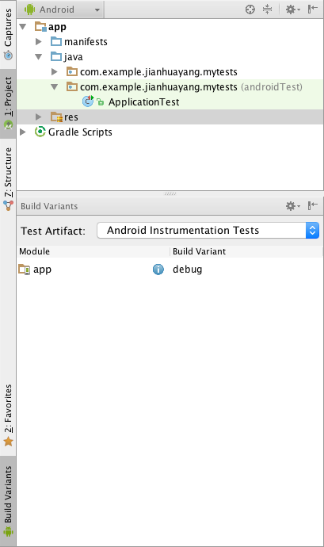
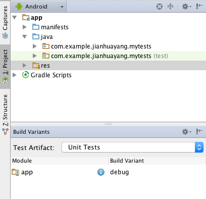
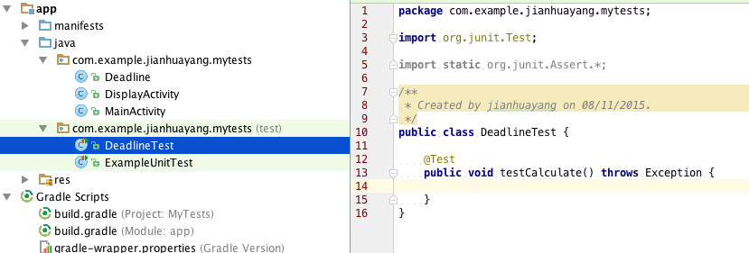

# Testing

Last week I showed that you need to be really careful with online tutorials. The (bad) example is the SharedPreferences tutorial on [TutorialsPoint](http://www.tutorialspoint.com/android/android_shared_preferences.htm) that uses MODE_WORLD_READABLE and MODE_WORLD_WRITEABLE, both of which were [deprecated in API level 17](http://developer.android.com/reference/android/content/Context.html#MODE_WORLD_READABLE). If that caused confusion already, could situation get worse? Read on.

> In general, TutorialsPoint is a good website. But some of the contents are out-of-date.

Click [this link](http://developer.android.com/training/testing/unit-testing/local-unit-tests.html) to go to the offical Android training on *Building Local Unit Tests*, locate texts that read *"Your local unit test class should be written as a JUnit 4 test class"*. Next, click on [this link](http://developer.android.com/tools/testing/testing_android.html) to go to the offical Android guide on *Testing Fundamentals*, locate texts that read *"Android testing API supports JUnit 3 code style, but not JUnit 4"*. To use JUnit 4, or not to use JUnit 4, that is the question. The answer? Read on.

## Lab 1 Unit testing

There're two types of testing in Android depending on whether an Android device (physial or AVD) is needed or not : local unit tests run on a local JVM on your development machine, and doesn't require Android devices; the other type of testing is called instrumented testing, which requires an Android device, as will be discussed later. At runtime, local unit tests will be executed against a modified version of android.jar where all final modifiers have been stripped off. For more info on this, click [here](http://tools.android.com/tech-docs/unit-testing-support).

### The idea of testing

Once you created some apps, you need to make sure it works as expected. The ways we have used in the past to do this is to use `Log.d()` to produce some results. This has been fine so far. What we could also do is to use the ['Assert'](http://developer.android.com/reference/junit/framework/Assert.html) class. But to this properly, we need to write testing classes. 

As an simple example, consider the following class (example taken from [JUnit introduction](https://github.com/junit-team/junit/wiki/Getting-started))

```java
public class Calculator {
  public int evaluate(String expression) {
    int sum = 0;
    for (String summand: expression.split("\\+"))
      sum += Integer.valueOf(summand);
    return sum;
  }
}
```

To check if it works properly or not we'll need to try it out. Put simply, we'll run the class with some string inputs such as `"1+2+3"` and see if the output is `6`. Put this in the onctext of JUnit testing, we have

```java
import static org.junit.Assert.assertEquals;
import org.junit.Test;

public class CalculatorTest {
  @Test
  public void evaluatesExpression() {
    Calculator calculator = new Calculator();
    int sum = calculator.evaluate("1+2+3");
    assertEquals(6, sum);
  }
}
```

Now this explains the idea of testing. Instead of JUnit, you'll see other tools/packages available for Java. But JUnit is what we need for Android. Now back to the question of JUnit 3 or JUnit 4, most of the syntax between the two are the same. But the differences are also huge. The most noticeable difference is the use of annotations in JUnit 4 such as `@Before` and `@after` in replacement of `setup()` and `tearDown()` in JUnit 3. Click [here](http://javarevisited.blogspot.co.uk/2012/06/junit4-annotations-test-examples-and.html) for a nice blog on JUnit 4 annotations.

> Some people use `@Before setup()` in their codes. Once you see this you know you're in JUnit 4. Here `setup()` is just a name, not an overriding method anymore.

### Default app and default tests

Let's have a look at the default tests generated by Android Studio

1. Create a new project called 'My Tests' using all default options. 
2. In the Project tool window, click on app ==> java. You'll see there're two sub-folders and the buttom one has suffix of '(androidTest)'. Click to open the Build Variants tool window, you'll see Test Artifact is Adroid Instrumentation Tests.
    
    
    
3. Switch Test Artifact to Unit Tests. You'll see the Java folder suffix changed to 'test'.
    
    
    
    As we know already, Gradle use conventions to build the system. The convention here is this:
    * Your 'main' codes and resources are saved in a folder called 'app/src/main'.
    * Your local unit tests are saved in a folder called 'app/src/test'.
    * Your instrumentation tests are saved in a folder called 'app/src/androidTest'.
    
    
    
4. Click to open ExampleUnitTests.java, what you'll see is the following
    
    ```java
    import org.junit.Test;
    import static org.junit.Assert.*;
    
    public class ExampleUnitTest {
        @Test
        public void addition_isCorrect() throws Exception {
            assertEquals(4, 2 + 2);
        }
    }
    ```
    
    Note the use of junit clasess. Also, here we used `import static` statement to import static members.
    
5. With Unit Tests set as the Test Artifact, right-click on ExampleUnitTest and select Run 'ExampleUnitTest'.
    
    
    
6. Now your Run tool window will look similar to this
    
    
    
    * The color of the status bar indicates whether the tests have passed successfully. Green or pass, red for fail.
    * The left-hand pane shows the tree view of all tests within the current run/debug configuration.
    * The toolbar provides controls that enable you to monitor the tests and analyze results. Notice the export icon (the one to the right of down-arrow), if you click it you'll be able to export the test results.
    
    
    
    > If you follow tutorials you found on the web, some talks about HTML reports generated in build/reports folder. Forget about it, those has been deprecated!

Now you have just finished your first ever tests!

### The 'Deadline' app

To do some testing excercises we'll need to create an app. Here we use an app that calculates the days left until 387COM assignment deadline (how exciting!). The idea of the app is that given the current date in the format of dd/mm/yy, the app should 

* Display how many days left until coursework submission once you click 'Update'.

    

* Save current date to SharedPreferences once you click 'Save'.
* Send current date to new activity once you click 'Send'.

    

Follow steps below to create the app. This is a simple app and should be self-explanary.

1. Replace what's in content_main.xml with the following:
    
    ```xml
    <?xml version="1.0" encoding="utf-8"?>
    <RelativeLayout xmlns:android="http://schemas.android.com/apk/res/android"
    xmlns:app="http://schemas.android.com/apk/res-auto"
    xmlns:tools="http://schemas.android.com/tools"
    android:layout_width="match_parent"
    android:layout_height="match_parent"
    android:paddingBottom="@dimen/activity_vertical_margin"
    android:paddingLeft="@dimen/activity_horizontal_margin"
    android:paddingRight="@dimen/activity_horizontal_margin"
    android:paddingTop="@dimen/activity_vertical_margin"
    app:layout_behavior="@string/appbar_scrolling_view_behavior"
    tools:context=".MainActivity"
    tools:showIn="@layout/activity_main">
    
    <TextView
        android:id="@+id/textView"
        android:layout_width="wrap_content"
        android:layout_height="wrap_content"
        android:text="Hi, there!"
        android:textSize="24sp" />
    
    <TextView
        android:id="@+id/textView1"
        android:layout_width="wrap_content"
        android:layout_height="wrap_content"
        android:layout_alignLeft="@id/textView"
        android:layout_below="@id/textView"
        android:layout_marginLeft="19dp"
        android:layout_marginTop="56dp"
        android:text="Current date:"
        android:textAppearance="?android:attr/textAppearanceSmall" />
    
    <EditText
        android:id="@+id/editText"
        android:layout_width="wrap_content"
        android:layout_height="wrap_content"
        android:layout_alignBaseline="@id/textView1"
        android:layout_alignBottom="@id/textView1"
        android:layout_marginLeft="36dp"
        android:layout_marginRight="40dp"
        android:layout_toRightOf="@id/textView1"
        android:ems="10"
        android:hint="dd/mm/yy"
        android:inputType="date" />
    
    <Button
        android:id="@+id/buttonUpdate"
        android:layout_width="wrap_content"
        android:layout_height="wrap_content"
        android:layout_alignParentLeft="true"
        android:layout_below="@+id/editText"
        android:layout_marginLeft="20dp"
        android:layout_marginTop="22dp"
        android:onClick="onUpdateClick"
        android:text="Update" />
    
    <Button
        android:id="@+id/buttonSave"
        android:layout_width="wrap_content"
        android:layout_height="wrap_content"
        android:layout_alignBottom="@+id/buttonUpdate"
        android:layout_centerHorizontal="true"
        android:layout_marginLeft="20dp"
        android:layout_toRightOf="@+id/buttonUpdate"
        android:onClick="onSaveClick"
        android:text="Save" />
    
    <Button
        android:id="@+id/buttonSend"
        android:layout_width="wrap_content"
        android:layout_height="wrap_content"
        android:layout_alignBottom="@id/buttonUpdate"
        android:layout_centerHorizontal="true"
        android:layout_marginLeft="20dp"
        android:layout_toRightOf="@id/buttonSave"
        android:onClick="onSendClick"
        android:text="Send" />
    </RelativeLayout>
    ```
    
2. Create a new Deadline class, and insert the following into Deadline.java
    
    ```java
    public class Deadline {
    
    private Date date;
    private Context context;
    private static DateFormat dateFormat = new SimpleDateFormat("dd/MM/yy");
    private static final String DATE_KEY = "dateKey";
    
    public Deadline(String date, Context context) {
        try {
            this.date = dateFormat.parse(date);
        } catch (ParseException e) {
            e.printStackTrace();
        }
        this.context = context;
    }
    
    public Deadline(String date) {
        try {
            this.date = dateFormat.parse(date);
        } catch (ParseException e) {
            e.printStackTrace();
        }
    }
    
    public int calculate() {
        Date submission;
        try {
            submission = dateFormat.parse("18/12/15");
            return (int) ((submission.getTime() - date.getTime() )/ (1000 * 60 * 60 * 24));
        } catch (ParseException e) {
            e.printStackTrace();
            return -1;
        }
    }
    
    public boolean save() {
        SharedPreferences sharedPreferences = ((Activity)context).getPreferences(Context.MODE_PRIVATE);
        SharedPreferences.Editor editor = sharedPreferences.edit();
        editor.putString(DATE_KEY, dateFormat.format(date));
        return editor.commit();
    }
    }
    ```
    
    This class has two methods. The `calculate()` method calculates the time difference in days between the input and the submission deadline which is 18/12/15. The `save()` method save the date data in a SharedPreferences xml file.
    
3. Open MainActivity.java, insert the following within the class definition:
    
    ```java
    private TextView textView;
    private EditText editText;
    private Deadline deadline;
    public static final String DAYS_KEY = "DAYS_KEY";
    
    public void onUpdateClick(View v){
        deadline = new Deadline(editText.getText().toString(), this);
        textView.setText(deadline.calculate() + " days to 387COM deadline!");
    }
    
    public void onSaveClick(View v){
        deadline = new Deadline(editText.getText().toString(), this);
        deadline.save();
    }
    
    public void onSendClick(View v){
        deadline = new Deadline(editText.getText().toString(), this);
        Intent intent = new Intent(this, DisplayActivity.class);
        intent.putExtra(DAYS_KEY, deadline.calculate());
        startActivity(intent);
    }
    ```
    
    Insert the following into `onCreate()` method:
    
    ```java
    editText = (EditText) findViewById(R.id.editText);
    textView = (TextView) findViewById(R.id.textView);
    ```
    
4. Craete a new empty Activity called Display Activity. Insert the following into activity_display.xml
    
    ```xml
    <RelativeLayout xmlns:android="http://schemas.android.com/apk/res/android"
    xmlns:tools="http://schemas.android.com/tools"
    android:layout_width="match_parent"
    android:layout_height="match_parent"
    android:paddingBottom="@dimen/activity_vertical_margin"
    android:paddingLeft="@dimen/activity_horizontal_margin"
    android:paddingRight="@dimen/activity_horizontal_margin"
    android:paddingTop="@dimen/activity_vertical_margin"
    tools:context="com.example.jianhuayang.mytests.DisplayActivity">
    
    <TextView
        android:id="@+id/textView"
        android:layout_width="match_parent"
        android:layout_height="wrap_content"
        android:textSize="50sp"
        android:text="aa"/>
    
    </RelativeLayout>
    ```
    
5. Open DisplayActivity.java, make changes so it looks like the following:
    
    ```java
    public class DisplayActivity extends AppCompatActivity {
    private TextView textView;
    
    @Override
    protected void onCreate(Bundle savedInstanceState) {
        super.onCreate(savedInstanceState);
        setContentView(R.layout.activity_display);
        
        textView = (TextView) findViewById(R.id.textView);
        Intent intent = getIntent();
        int daysLeft = intent.getIntExtra(MainActivity.DAYS_KEY, 0);
        textView.setText(Integer.toString(daysLeft + 13) + " days until 2016!" );
        
    }
    }
    ```
    

### Local unit tests

The critial part of the app above is the ability to calculate time difference. Now let's design a test for this.

1. Make sure Unit Tests is selected in Build Variants tool window.
2. Open Deadline.java, navigate your cursor to be within the class body (not within member methods), right-click and select Go To ==> Test.
    
    
    
3. In the window that pops up, select Create New Test. Then change from JUnit3 to Junit4, check the 'calculate' box, click OK.
    
    
    
    We just created created a testing class for Deadline, and this new class appears in the test package.
    
    
    
4. Insert the following into `DeadlineTest()` so it becomes
    
    ```java
    @Test
    public void testCalculate() throws Exception {
        Deadline deadline = new Deadline("17/12/15");
        assertEquals(deadline.calculate(), 1);
    }
    ```
    
    The test itself is a public class. Here we use an annotation to mark the actual test we want to run, which is a member method in that class. We then simply declare a new instance of the class that we know the claculation result.
    
5. If you right-click on the DeadlineTest in Project tool window and click Run 'DeadlineTest', you'll see something similar to below:
    
    
    
    The test runs at local JVM and finishes without any error. If you change assertion to `assertEquals(deadline.calculate(), 2)` and run it, what happens?

### Local mocked unit tests

The test we did above used a Deadline constructor that doesn't require the Context input parameter. This is becuase Context is Android dependant we cannot run it on a local JVM. The way to get around this is to use a mocking framwork called Mockito.

1. Open build.gradle (Module: app), insert Mockito and Hamcrest dependencies so it becomes
    
    ```xml
    dependencies {
        compile fileTree(dir: 'libs', include: ['*.jar'])
        testCompile 'junit:junit:4.12'
        testCompile 'org.mockito:mockito-core:1.10.19'
        testCompile 'org.hamcrest:hamcrest-library:1.1'
        compile 'com.android.support:appcompat-v7:23.1.0'
        compile 'com.android.support:design:23.1.0'
    }
    ```
    
    Mmockito is a mocking framework, and Hamcrest is a package to make testing more readable. You'll see later.
    
2. Paste the following codes to replace the class body of DeadlineTest
    
    ```java
    @SmallTest
    @RunWith(MockitoJUnitRunner.class)
    public class DeadlineTest {
    
        @Mock
        Context context;
        
        @Mock
        Activity activity;
        
        @Mock
        SharedPreferences sharedPreferences;
        
        @Mock
        SharedPreferences.Editor editor;
        
        private Deadline deadline;
        
        @Test
        public void testCalculate() throws Exception {
            Deadline deadline = new Deadline("17/12/15");
            assertEquals(deadline.calculate(), 1);

        }

        @Test
        public void testCalculate2() throws Exception {
            Deadline deadline = new Deadline("16/12/15", context);
            assertThat("check if time interval is calculated properly", deadline.calculate(), is(equalTo(2)));

        }

        @Before
        public void initTests() {
            deadline = new Deadline("15/12/15", activity);
        }

        @Test
        public void testSave() throws Exception {

            when(activity.getPreferences(Context.MODE_PRIVATE)).thenReturn(sharedPreferences);
            when(sharedPreferences.edit()).thenReturn(editor);
            when(editor.commit()).thenReturn(true);
            assertThat(deadline.save(), is(true));
        }
    }
    ```
    
    There're quite a lot going on here:
    * `@SmallTest` is a way to classify different tests, as you guessed, so later on we can ask the system to run for example SmallTests only. Check out [here](http://developer.android.com/tools/testing/testing_otheride.html) for an example. Also this [StackOverflow page](http://stackoverflow.com/questions/4671923/what-is-the-purpose-of-smalltest-mediumtest-and-largetest-annotations-in-an) for the differences among SmallTest, MediumTest and LargeTest.
    * `@RunWith` line specifies the Runner of the current testing class. A Runner is merely another class that is designed to perform some specific functions. In the current case, MockitoJUnitRunner will mock our dependencies in Android system. An example Runner is something like below (example taken from [TutorialsPoint](http://www.tutorialspoint.com/junit/junit_suite_test.htm))
    ```
    import org.junit.runner.JUnitCore;
    import org.junit.runner.Result;
    import org.junit.runner.notification.Failure;
    
    public class TestRunner {
        public static void main(String[] args) {
           Result result = JUnitCore.runClasses(JunitTestSuite.class);
           for (Failure failure : result.getFailures()) {
              System.out.println(failure.toString());
           }
           System.out.println(result.wasSuccessful());
        }
    }
    ```
    * `@Mock` line indicates a variable is being mocked. When being mocked, all methods of the class throw exceptions. This is because the android.jar file that is used to run unit tests does not contain any actual code. For more details on this, read [here](http://tools.android.com/tech-docs/unit-testing-support)
    * `@Before` line indicates the code block will be invoked before each test. You should use this annotation to specify a block of code with test setup operations.
    * In `testSave()` method we used `when().thenReturn()` to mock the behavior of mocked classes. This is because context/activity etc. are all mocked objects, which don't contain any actual methods. You'll need to supply some results once there methods are called.
    * Note in line `assertThat("check if time interval is calculated properly", deadline.calculate(), is(equalTo(2)))` we used `assertThat`, `is` and `equalTo` from Hamcrest to increase readability. But this is essentially the same as `assertEquals(deadline.calculate(), 2)`. Here `is` and `equalTo` are both matchers.
    
3. Right-click and run DeadlineTest, then export the results to HTML. Locate and open that HTML file, you'll see something similar to below:
    
    

## Lab 2 Instrumented testing

Tests we've done so far run on local JVM and don't require Androd devices. If you need to access Android system resources such as Context you need to test your app on an actual device or an AVD. Android instrumentation is a set of control methods or 'hooks' in the Android system. With Android instrumentation, you can invoke for example activity callback methods in your test code. This gives you fine-control of everything.

### Instrumented unit tests


### UI tests using Espresso


## Lab 3 Advanced topics

### What to test

### Official resources for Android Testing

* [Best practices for testing](http://developer.android.com/training/testing.html)
* [Android workflow testing](http://developer.android.com/tools/testing/index.html)
* [Android testing tools](http://developer.android.com/tools/testing/testing-tools.html)
* The testing section in [Gradle Plugin User Guide](http://tools.android.com/tech-docs/new-build-system/user-guide#TOC-Testing)
* Android Studio [unit testing support](http://tools.android.com/tech-docs/unit-testing-support)
* Android testing samples on [GitHub](https://github.com/googlesamples/android-testing)

ActivityInstrumentationTestCase2 will become deprecated you need to define a @Rule.
http://wiebe-elsinga.com/blog/whats-new-in-android-testing/

### IntelliJ resources for Android Testing

* [Testing](https://www.jetbrains.com/idea/help/testing.html)
* [Testing Android Applications](https://www.jetbrains.com/idea/help/testing-android-applications.html)
* [Test Runner Tab](https://www.jetbrains.com/idea/help/test-runner-tab.html)


