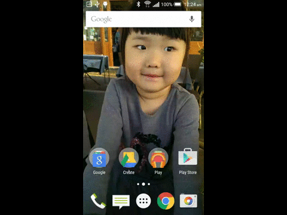
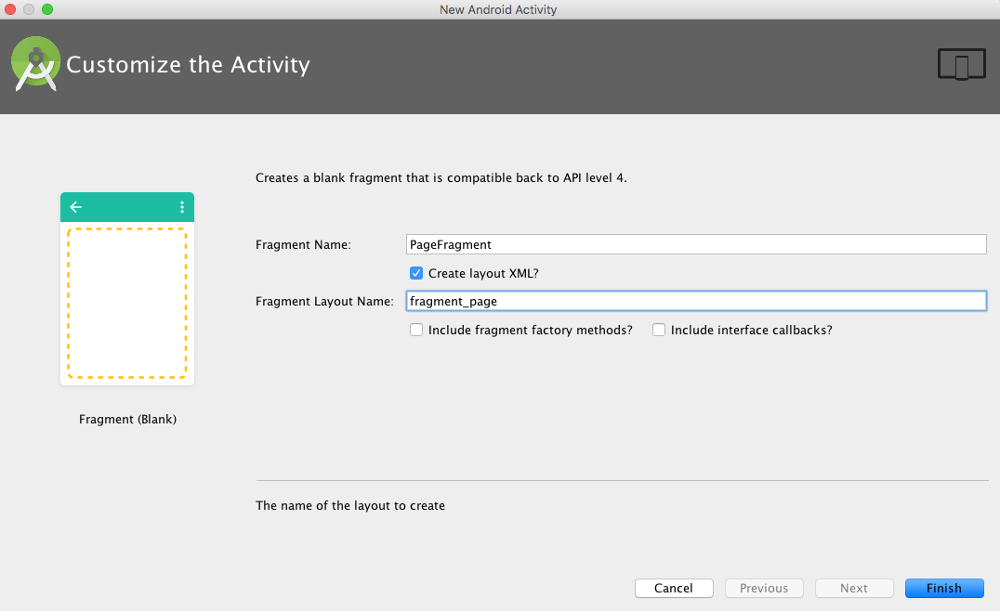
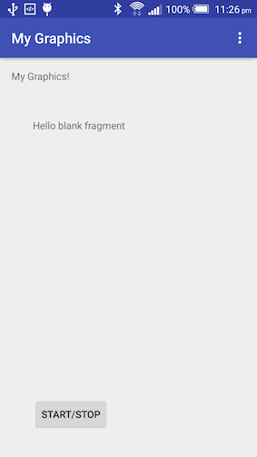
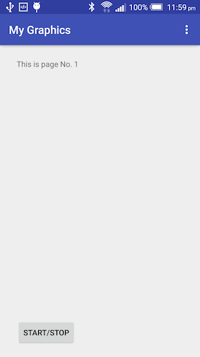
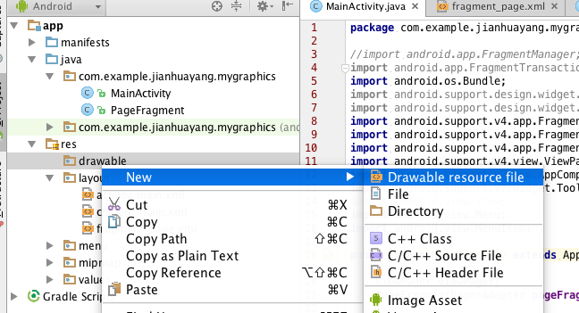
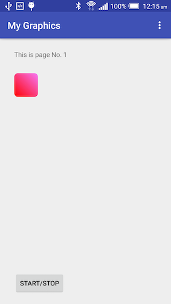

# Graphics and Animation

> The fool doth think he is a 387COMer, but the 387COMer knows himself to be a fool.
> -- [William Shakespeare Quote Generator](http://thesurrealist.co.uk)

Android provides a number of useful APIs for manipulating graphics and animation. We will look at some simple examples in the exercises below. Full documentations on this can be found [here](http://developer.android.com/guide/topics/graphics/overview.html). Opon finishing the exercises, you should have an app that looks like below. The app has two 'pages', each of which contain a single graphic. If you press the 'start/stop' button, you'll start/stop the animation on that graphic.

[](https://youtu.be/ewk5-RKs-X4)

## Lab 1 Graphics

During previous weeks, we've used various UI controls that are provided by the system. However, we haven't created any shapes or views ourselves. In the 1st lab of the week, we'll learn how to do it. But before that, let's create an app that has two 'pages' and that uses a ViewPager for the transition between the two. 

### ViewPager

Create an app called My Graphics using all default options. Then follow steps below to add ViewPager that allows the user to flip left and right through pages.

1. Right-click your app's package name, then select New ==> Fragment ==> Fragment (Blank). Name it PageFragment, and uncheck the bottom two options.
    
    
    
2. Open fragment_page.xml and edit so it looks similar the following
    
    ```xml
    <FrameLayout xmlns:android="http://schemas.android.com/apk/res/android"
    xmlns:tools="http://schemas.android.com/tools"
    android:id="@+id/frameLayout"
    android:layout_width="match_parent"
    android:layout_height="match_parent"
    tools:context="com.example.jianhuayang.mygraphics.PageFragment">
    
    <RelativeLayout
        android:id="@+id/container"
        android:layout_width="match_parent"
        android:layout_height="match_parent"
        android:orientation="vertical">
    
        <TextView
            android:id="@+id/title"
            android:layout_width="match_parent"
            android:layout_height="wrap_content"
            android:layout_marginLeft="30dp"
            android:layout_marginTop="30dp"
            android:text="@string/hello_blank_fragment" />
    
        <ImageView
            android:id="@+id/body"
            android:layout_width="50dp"
            android:layout_height="50dp"
            android:layout_below="@id/title"
            android:layout_marginLeft="30dp"
            android:layout_marginTop="30dp"
            android:text="xxx" />
    
        <Button
            android:id="@+id/button"
            android:layout_width="wrap_content"
            android:layout_height="wrap_content"
            android:layout_alignParentBottom="true"
            android:layout_marginBottom="20dp"
            android:layout_marginLeft="30dp"
            android:text="Start/Stop" />
    
    </RelativeLayout>
    
    </FrameLayout>
    
    ```
    
3. Open MainActivity.java, insert the following code into `onCreate()` method. 
    
    ```java
    FragmentManager fragmentManager = getFragmentManager();
    FragmentTransaction fragmentTransaction = fragmentManager.beginTransaction();
    PageFragment pageFragment = new PageFragment();
    fragmentTransaction.add(R.id.frameLayout, pageFragment);
    fragmentTransaction.commit();
    ```
    
4. Open content_main.xml and replace the TextView with the following
    
    ```xml
    <TextView
        android:id="@+id/textView"
        android:layout_width="wrap_content"
        android:layout_height="wrap_content"
        android:text="My Graphics!" 
    />

    <FrameLayout
        android:id="@+id/frameLayout"
        android:layout_width="match_parent"
        android:layout_height="match_parent"
        android:layout_alignLeft="@+id/textView"
        android:layout_alignStart="@+id/textView"
        android:layout_below="@+id/textView"
        android:layout_marginTop="20dp">
    </FrameLayout>
    ```
    
    The exercises above is something we have done before when we learned Fragments. If this doesn't look familiar, you'll need to go back and check previous material. If you run the app at this moment, you'll see something similar to below.
    
    
    
5. While you're still in content_main.xml, replace everything in between the RelativeLayout tags (include all its children) with the following:
    
    ```xml
    <android.support.v4.view.ViewPager xmlns:android="http://schemas.android.com/apk/res/android"
    android:id="@+id/viewPager"
    android:layout_width="match_parent"
    android:layout_marginTop="50dp"
    android:layout_height="match_parent" 
    />
    ```
    
    Similar to ListView in a ListActivity, we can use ViewPager as the single element in a layout file, or we can use it in combination with other views. Here it's the only thing we need. Also note ViewPager is dependant on v4 version of the support library.
    
6. Open PageFragment.java, make changes so that it looks like the following:
    
    ```java
    public class PageFragment extends android.support.v4.app.Fragment {
    
        public static final String ARG_PAGE = "ARG_PAGE";
        public static final String DEBUG_KEY = "DEBUG_KEY";
        private int pageNumber;

        public static PageFragment create(int pageNumber) {
            PageFragment pageFragment = new PageFragment();
            Bundle bundle = new Bundle();
            bundle.putInt(ARG_PAGE, pageNumber);
            pageFragment.setArguments(bundle);
            return pageFragment;
        }
        
        public PageFragment() {
            // Required empty public constructor
        }
        
        @Override
        public void onCreate(Bundle b) {
            super.onCreate(b);
            pageNumber = getArguments().getInt(ARG_PAGE);
            
        }
        
        @Override
        public View onCreateView(LayoutInflater inflater, ViewGroup container,
                                 Bundle savedInstanceState) {
            // Inflate the layout for this fragment
            View v = inflater.inflate(R.layout.fragment_page, container, false);
            Log.d(DEBUG_KEY, Integer.toString(pageNumber));
            TextView textView = (TextView) v.findViewById(R.id.title);
            textView.setText("This is page No. " + Integer.toString(pageNumber + 1));
            
            return v;
        }
        
    }
    ```
    
    Here line `public static PageFragment create(int pageNumber) {}` declare a method using the [factory pattern](http://www.tutorialspoint.com/design_pattern/factory_pattern.htm). Instead of using constructors and passing values using Bundle, we use the static factory method to create the fragment object. In the `onCreate()` method we get the variable that is passed into the fragment. And this variable is later used in the `onCreateView()` method to update the TextView texts.

7. Open MainActivity.java and comment out the following lines:
    
    ```java
    FragmentManager fragmentManager = getFragmentManager();
    FragmentTransaction fragmentTransaction = fragmentManager.beginTransaction();
    PageFragment pageFragment = new PageFragment();
    fragmentTransaction.add(R.id.frameLayout, pageFragment);
    fragmentTransaction.commit();
    ```
    
8. In MainActivity.java insert the following declaration for member variables:
    
    ```java
    ViewPager viewPager;
    PageFragmentPagerAdapter pageFragmentPagerAdapter;
    ```
    
    Insert the following into the `onCreate()` method:
    
    ```java
    viewPager = (ViewPager) findViewById(R.id.viewPager);
    pageFragmentPagerAdapter = new PageFragmentPagerAdapter(getSupportFragmentManager());
    viewPager.setAdapter(pageFragmentPagerAdapter);
    ```
    
9. Again, in MainActivity.java insert the following as a member method:
    
    ```java
    private class PageFragmentPagerAdapter extends FragmentStatePagerAdapter {

        public PageFragmentPagerAdapter(FragmentManager fm) {
            super(fm);
        }

        @Override
        public Fragment getItem(int position) {
            return PageFragment.create(position);
        }

        @Override
        public int getCount() {
            return 2;
        }
    }
    ```
    
    In order to combine Fragment with ViewPager, you have to use an FragmentStatePagerAdapter, which is a subclass of android.support.v4.view.PagerAdapter. This is not to be confused with android.widget.Adapter, which is used to work together with AdapterView to achieve dynamic data binding. For FragmentStatePagerAdapter we need to override the two methods `getItem()` and `getCount()`. Note here the two Fragments will be created as soon as ViewPager becomes visible. This means that ordinary call-backs for Fragment such as `onPause()` etc. will not work!
    
    If you run the app now, you'll see two 'pages' that allows you to switch between each other using sliding
    
    
    
    

### Drawable resources for ShapeDrawable

Now we're ready to insert some shapes into the 1st page. We have images as drawables. We can also define the shapes in an xml file.

1. Right-click on the drawable folder to create a Drawable resource file, name it gradient_box.
    
    
    
2. Replace the 'selector' tag with the following:
    
    ```xml
    <shape xmlns:android="http://schemas.android.com/apk/res/android"
    android:shape="rectangle">
    <gradient
        android:startColor="#FFFF0000"
        android:endColor="#80FF00FF"
        android:angle="45"/>
    <padding android:left="7dp"
        android:top="7dp"
        android:right="7dp"
        android:bottom="7dp" />
    <corners android:radius="8dp" />
    </shape>
    ```
    
    Here we define a rectangle shape and customize it using gradient and padding tags. A full list of available tags and attributes can be found [here](http://developer.android.com/guide/topics/resources/drawable-resource.html#Shape). If you open the Preview tool window, you'll see something like below
    
    
    
3. Open PageFragment.java, insert the following line into the `onCreateView()` method, before the final `return v;` clause
    
    ```java
    if (pageNumber == 0) {
            Drawable drawable = ContextCompat.getDrawable(getContext(), R.drawable.gradient_box);
            ImageView image = (ImageView) v.findViewById(R.id.body);
            image.setImageDrawable(drawable);
        }
    ```
    
    If you run the app now you'll see that on the first page a little rectangle shape has been created:
    
    
    

### Extending View class

You can also craete a customized class by extending View and include ShapeDrawables in it.

1. Create a new class called CustomDrawableView and insert the following code:
    
    ```java
    public class CustomDrawableView extends View {
    private ShapeDrawable mDrawable;
    
    public CustomDrawableView(Context context) {
        super(context);
        
        int x = 10;
        int y = 10;
        int width = 300;
        int height = 50;

        mDrawable = new ShapeDrawable(new OvalShape());
        mDrawable.getPaint().setColor(0xff74AC23);
        mDrawable.setBounds(x, y, x + width, y + height);
    }
    
    protected void onDraw(Canvas canvas) {
        mDrawable.draw(canvas);
    }
    }
    ```
    
    This is an example taken from the office [API guide](http://developer.android.com/guide/topics/graphics/2d-graphics.html#drawables-from-xml). After defining the oval shape in constructor, once `View.onDraw()` is called, our shape will draw itself on the canvas provided by the syste.
    
2. Open PageFragment.java, edit the `if` clause inside `onCreateView()` method so it becomes the following
    
    ```java
    if (pageNumber == 0) {
            Drawable drawable = ContextCompat.getDrawable(getContext(), R.drawable.gradient_box);
            ImageView image = (ImageView) v.findViewById(R.id.body);
            image.setImageDrawable(drawable);
        } else if (pageNumber == 1) {
            ImageView imageView = (ImageView) v.findViewById(R.id.body);
            imageView.setVisibility(View.GONE);
            RelativeLayout relativeLayout = (RelativeLayout) v.findViewById(R.id.container);
            CustomDrawableView customDrawableView = new CustomDrawableView(getContext());
            RelativeLayout.LayoutParams params = new RelativeLayout.LayoutParams(ViewGroup.LayoutParams.WRAP_CONTENT, ViewGroup.LayoutParams.WRAP_CONTENT);
            params.setMargins(80, 80, 0, 0);
            params.addRule(RelativeLayout.BELOW, textView.getId());
            relativeLayout.addView(customDrawableView, params);
    }
    ```
    
    For the second page, what we did is that we hide the ImageView by setting its visibility to GONE. Then we create a new CustomDrawableView and add it to the RelativeLayout. For more info on LayoutParams click [here](http://developer.android.com/guide/topics/ui/declaring-layout.html#layout-params).

## Lab 2 Animations

There're (at least!) two ways to do animation. One is to use property animation and the other is View animation. While the former is capable of animating any objects, the latter is limitted to Views only. We'll look at examples of both.

What I did in the exercise is that I duplicated the foler created earlier for lab 1 and renamed it MyGraphics2. But you can leave this step if you want.

### Property animation

1. Open PageFragmet.java and move variable declaration outside of the `onCreateView()` method. So the method should look like
    
    ```java
    @Override
    public View onCreateView(LayoutInflater inflater, ViewGroup container,
                             Bundle savedInstanceState) {
        // Inflate the layout for this fragment
        View v = inflater.inflate(R.layout.fragment_page, container, false);
        Log.d(DEBUG_KEY, Integer.toString(pageNumber));
        textView = (TextView) v.findViewById(R.id.title);
        textView.setText("This is page No. " + Integer.toString(pageNumber + 1));
        imageView = (ImageView) v.findViewById(R.id.body);
        if (pageNumber == 0) {
            Drawable drawable = ContextCompat.getDrawable(getContext(), R.drawable.gradient_box);
            imageView.setImageDrawable(drawable);
        } else if (pageNumber == 1) {
            imageView.setVisibility(View.GONE);
            RelativeLayout relativeLayout = (RelativeLayout) v.findViewById(R.id.container);
            CustomDrawableView customDrawableView = new CustomDrawableView(getContext());
            RelativeLayout.LayoutParams params = new RelativeLayout.LayoutParams(ViewGroup.LayoutParams.WRAP_CONTENT, ViewGroup.LayoutParams.WRAP_CONTENT);
            params.setMargins(80, 80, 0, 0);
            params.addRule(RelativeLayout.BELOW, textView.getId());
            relativeLayout.addView(customDrawableView, params);
            
        }
        return v;
    }
    ```
    
2. Add some more variable declarations in the class
    
    ```java
    public static final String ARG_PAGE = "ARG_PAGE";
    public static final String DEBUG_KEY = "DEBUG_KEY";
    private int pageNumber;
    
    private TextView textView;
    private ImageView imageView;
    private Button button;
    private AnimatorSet set;
    private boolean isAnimatorSetOn = false;
    private CustomDrawableView customDrawableView;
    private Animation hyperspaceJumpAnimation;
    ```
    
2. In the Android tool window, right-click on the res folder and select New ==> Android Resource Directory, select animator as the type and click OK.
    
    
    
3. Right-click on the animator folder that was just created, and create a resource file called property_animator.xml
4. Edit  so it looks like the following
    
    ```xml
    <?xml version="1.0" encoding="utf-8"?>
    <set xmlns:android="http://schemas.android.com/apk/res/android">
    <set>
        <objectAnimator
            android:duration="500"
            android:propertyName="x"
            android:repeatCount="infinite"
            android:repeatMode="reverse"
            android:valueTo="800"
            android:valueType="floatType" />
        <objectAnimator
            android:duration="500"
            android:propertyName="y"
            android:repeatCount="infinite"
            android:repeatMode="reverse"
            android:valueTo="300"
            android:valueType="floatType" />
    </set>
    <objectAnimator
        android:duration="500"
        android:propertyName="alpha"
        android:repeatCount="infinite"
        android:repeatMode="reverse"
        android:valueTo="0f" />
    </set>
    ```
    
    Here we defined two levels of herirachy by using the 'set' tag. 
    
5. aa
    
    ```java
    if (pageNumber == 0) {
            Drawable drawable = ContextCompat.getDrawable(getContext(), R.drawable.gradient_box);
            imageView.setImageDrawable(drawable);
            
            set = (AnimatorSet) AnimatorInflater.loadAnimator(getContext(), R.animator.property_animator);
            set.setTarget(imageView);
            
            button.setOnClickListener(new View.OnClickListener() {
                @Override
                public void onClick(View view) {
                
                    if (!isAnimatorSetOn) {
                        set.start();
                        isAnimatorSetOn = true;
                    } else {
                        set.cancel();
                        isAnimatorSetOn = false;
                    }
                    
                    Log.d("DEBUG_KEY", "clicked button page 1");
                }
            });
            
        }
    ```

### View animation

```xml
<?xml version="1.0" encoding="utf-8"?>
<set xmlns:android="http://schemas.android.com/apk/res/android" android:shareInterpolator="false">
    <scale
        android:interpolator="@android:anim/accelerate_decelerate_interpolator"
        android:fromXScale="1.0"
        android:toXScale="1.4"
        android:fromYScale="1.0"
        android:toYScale="0.6"
        android:pivotX="50%"
        android:pivotY="50%"
        android:fillAfter="false"
        android:duration="700" />
    <set android:interpolator="@android:anim/decelerate_interpolator">
        <scale
            android:fromXScale="1.4"
            android:toXScale="0.0"
            android:fromYScale="0.6"
            android:toYScale="0.0"
            android:pivotX="50%"
            android:pivotY="50%"
            android:startOffset="700"
            android:duration="400"
            android:fillBefore="false" />
        <rotate
            android:fromDegrees="0"
            android:toDegrees="-45"
            android:toYScale="0.0"
            android:pivotX="50%"
            android:pivotY="50%"
            android:startOffset="700"
            android:duration="400" />
    </set>
</set>
```

```java
button = (Button) v.findViewById(R.id.button);
```


```java
else if (pageNumber == 1) {

            imageView.setVisibility(View.GONE);
            RelativeLayout relativeLayout = (RelativeLayout) v.findViewById(R.id.container);
            customDrawableView = new CustomDrawableView(getContext());
            RelativeLayout.LayoutParams params = new RelativeLayout.LayoutParams(ViewGroup.LayoutParams.WRAP_CONTENT, ViewGroup.LayoutParams.WRAP_CONTENT);
            params.setMargins(80, 80, 0, 0);
            params.addRule(RelativeLayout.BELOW, textView.getId());
            relativeLayout.addView(customDrawableView, params);

            hyperspaceJumpAnimation = AnimationUtils.loadAnimation(getActivity(), R.anim.hyperspace_jump);

            button.setOnClickListener(new View.OnClickListener() {
                @Override
                public void onClick(View view) {

                    if (!isAnimatorSetOn) {
                        customDrawableView.startAnimation(hyperspaceJumpAnimation);
                        isAnimatorSetOn = true;
                    } else {
                        customDrawableView.clearAnimation();
                        isAnimatorSetOn = false;
                    }

                    Log.d("DEBUG_KEY", "clicked button page 1");
                }
            });


        }
```


## Lab 3 Useful Resources

### OpenGL ES 

Android includes support for high performance 2D and 3D graphics with the Open Graphics Library (OpenGL®), specifically, the OpenGL ES API. Our past student *Fabian Furger*, a fellow citizen of Roger Federer, has created a squash training app using OpenGL.

* Squash simulation on [GitHub](https://github.com/furgerf/Squash/tree/master/Squash%20Simulation)
* YouTube [video](https://www.youtube.com/watch?v=4VqZXWbodaY)

### Other useful links


* [Beginner's Guide to Android Animation/Graphics](http://www.codeproject.com/Articles/825700/Beginners-Guide-to-Android-Animation-Graphics)
* [add submodule in Git](https://git-scm.com/book/en/v2/Git-Tools-Submodules)
<!--(git submodule add https://github.com/jianhuayang/Squash.git)-->

* [How to embed a video into GitHub README.md](http://stackoverflow.com/questions/4279611/how-to-embed-a-video-into-github-readme-md/29842302#29842302)
* [EZGif.com/](http://ezgif.com)